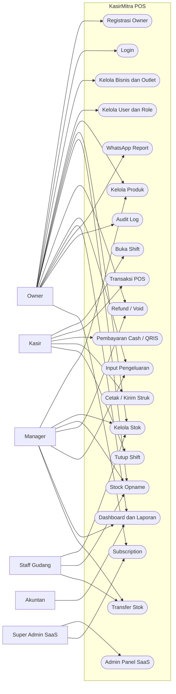
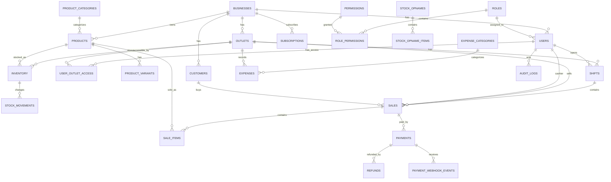
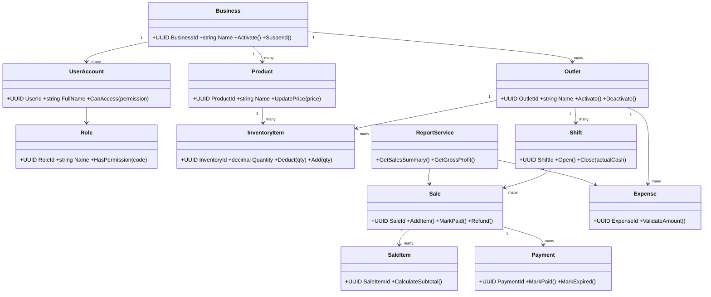
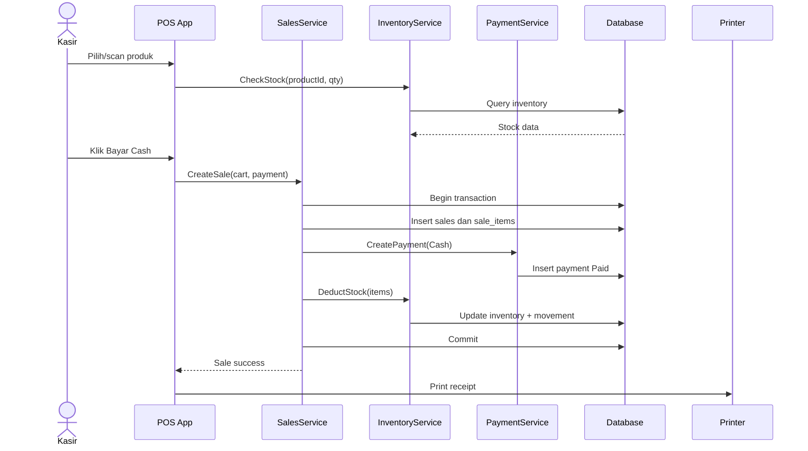
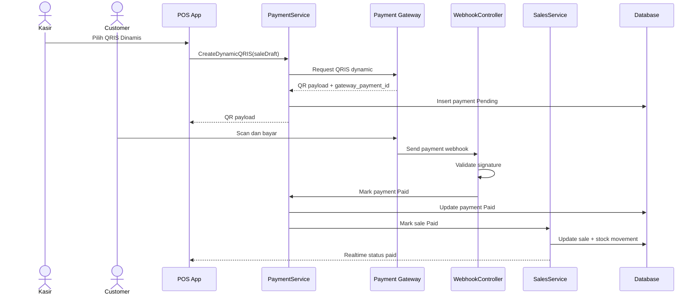
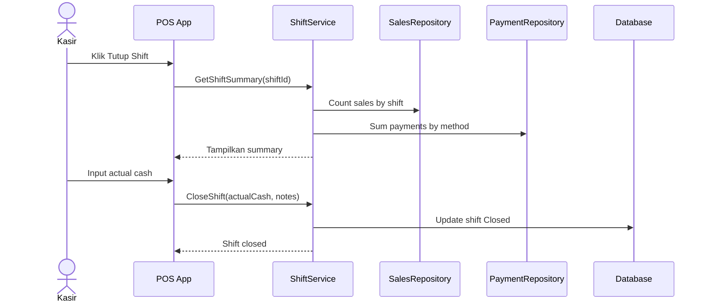
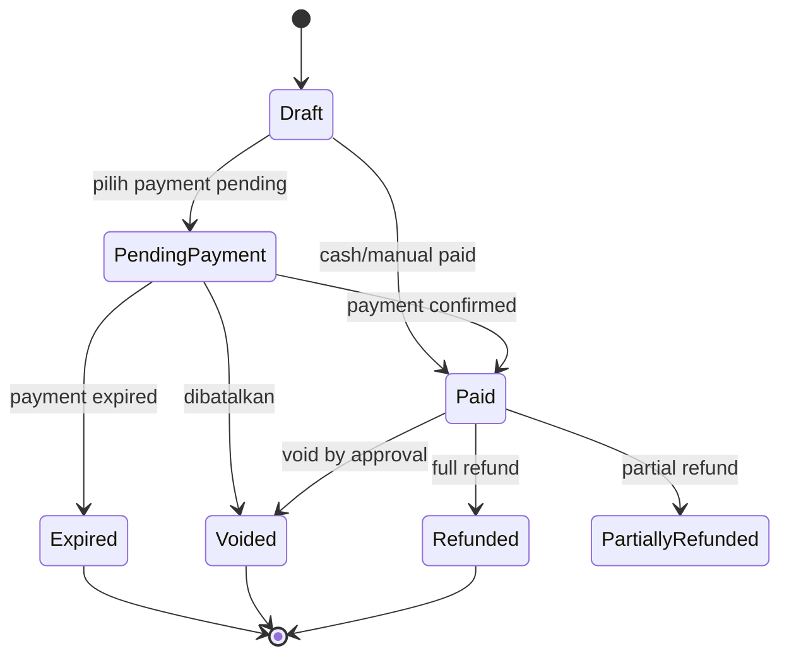
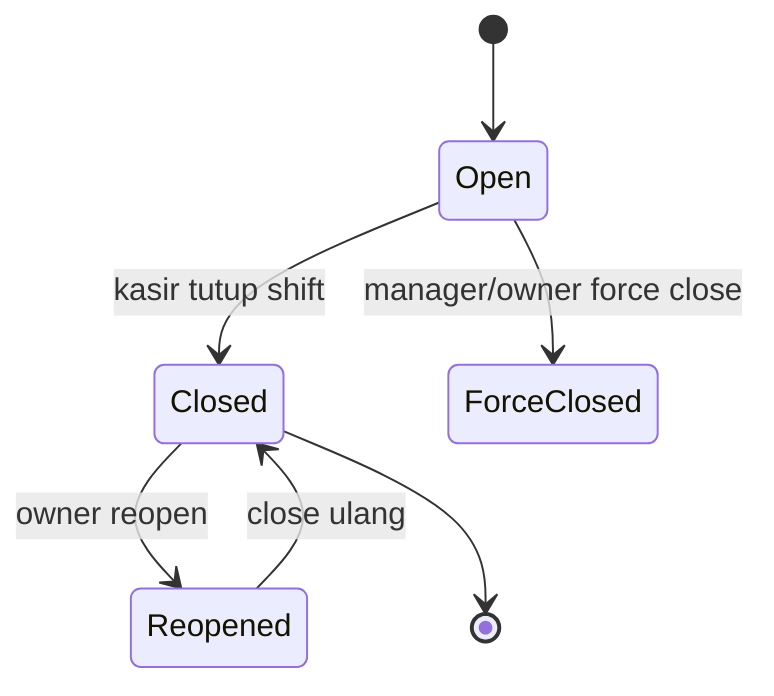

# PRD Stoqi  
## POS + Stok + QRIS + Laporan Keuangan Sederhana

---

## 📌 Informasi Umum

| Field | Detail |
|------|--------|
| Platform | SaaS Web App / PWA / Mobile-friendly Web |
| Target Perangkat | HP Android, Tablet Android, Laptop, Browser Modern |
| Database | PostgreSQL (Production), SQLite (Prototype Lokal) |
| Tema UI | Emerald, Teal, Cyan, Slate, Amber |
| Role | Super Admin, Owner, Manager, Kasir, Staff Gudang, Akuntan |
| Status Dokumen | Draft Lengkap (Siap Implementasi) |
| Versi | 1.0 |
| Tanggal | 28 April 2026 |

---
## 🎯 Deskripsi Singkat

Stoqi adalah platform SaaS untuk membantu bisnis mengelola penjualan, stok, pembayaran QRIS, dan laporan keuangan secara sederhana, cepat, dan terintegrasi dalam satu sistem.
---

# Daftar Isi

1. Ringkasan Produk
2. Latar Belakang
3. Visi Produk
4. Tujuan Produk
5. Ruang Lingkup Sistem
6. Role Pengguna
7. Matriks Hak Akses
8. Gambaran Umum Alur Sistem
9. Fitur Utama Sistem
10. Use Case Utama
11. Diagram Use Case
12. Spesifikasi Use Case Detail
13. Kebutuhan Fungsional
14. Kebutuhan Modul
15. Kebutuhan Non-Fungsional
16. Aturan Bisnis
17. Validasi Data
18. Status dan Lifecycle Data
19. Struktur Database Umum
20. Detail Tabel Database
21. ERD
22. Relasi Database
23. Model Class / Domain Model
24. Diagram Class
25. Sequence Diagram
26. Diagram Status
27. Struktur Arsitektur Proyek
28. Desain Tampilan UI
29. Rekomendasi Layout Dashboard
30. Query Data Dashboard yang Disarankan
31. API Endpoint yang Disarankan
32. Event Tracking dan Analytics
33. Pembagian Tugas Tim
34. Skenario Demo Presentasi
35. Pricing dan Paket Produk
36. Roadmap Implementasi
37. Testing dan Quality Assurance
38. Risiko dan Solusi
39. Rekomendasi Implementasi Bertahap
40. Kesimpulan

---

# 1. Ringkasan Produk

## 1.1 Nama Produk

**KasirMitra POS — Aplikasi Kasir, Stok, QRIS, dan Laporan Keuangan Sederhana untuk UMKM Indonesia**

Alternatif nama produk:

1. KasirMitra.
2. TokoPilot.
3. WarungOS.
4. KasirGo.
5. MitraKasir.
6. TokoRapi.
7. DagangOS.

## 1.2 Jenis Produk

KasirMitra POS adalah aplikasi SaaS berbasis web/PWA untuk membantu UMKM mencatat penjualan, mengelola stok, merekap pembayaran QRIS, mengontrol kasir, dan membaca laporan keuangan sederhana.

Produk ini bukan software akuntansi berat. Fokusnya adalah operasional harian: transaksi cepat, stok otomatis, pembayaran rapi, dan owner tahu kondisi bisnis dari HP.

## 1.3 Tujuan Utama

1. Kasir mencatat transaksi dengan cepat.
2. Stok produk otomatis berkurang ketika transaksi berhasil.
3. Owner melihat omzet, transaksi, metode pembayaran, produk terlaris, stok menipis, laba kotor, dan pengeluaran.
4. QRIS bisa dicatat manual pada MVP dan diintegrasikan secara dinamis pada versi Pro.
5. Owner menerima laporan dashboard dan WhatsApp.
6. Manager dapat mengelola stok, supplier, produk, pegawai, dan outlet.
7. Sistem mendukung multi-role dan multi-outlet.

## 1.4 One-Line Pitch

> Aplikasi kasir UMKM yang otomatis catat penjualan, kurangi stok, rekap QRIS, dan kirim laporan untung harian ke WhatsApp owner.

## 1.5 Core Value Proposition

| Value              | Penjelasan                                                                                    |
| ------------------ | --------------------------------------------------------------------------------------------- |
| Transaksi cepat    | Kasir bisa menyelesaikan transaksi normal dalam beberapa klik.                                |
| Stok otomatis      | Setiap produk terjual langsung mengurangi stok.                                               |
| QRIS rapi          | Pembayaran QRIS tidak hanya masuk rekening, tetapi juga tercatat di laporan.                  |
| Laporan mudah      | Owner melihat omzet, laba kotor, payment mix, dan stok menipis tanpa istilah akuntansi berat. |
| Kontrol pegawai    | Refund, void, diskon, dan tutup shift tercatat jelas.                                         |
| WhatsApp report    | Owner menerima rekap harian tanpa membuka dashboard.                                          |
| Offline terbatas   | Transaksi tetap bisa dicatat saat internet bermasalah.                                        |
| Multi-outlet ready | Arsitektur sejak awal mendukung cabang.                                                       |

---

# 2. Latar Belakang

Banyak UMKM sudah menerima QRIS dan transaksi digital, tetapi pencatatan operasional masih manual. Transaksi sering dicatat di buku, Excel, atau hanya mengandalkan mutasi rekening. Akibatnya owner sulit mengetahui performa usaha secara real-time.

Masalah yang sering muncul:

- Penjualan tidak tercatat rapi.
- Stok sering selisih.
- QRIS masuk rekening, tetapi tidak tersambung ke transaksi kasir.
- Owner tidak tahu laba karena HPP dan pengeluaran tidak dihitung.
- Kasir bisa memberi diskon, refund, atau membatalkan transaksi tanpa audit jelas.
- Owner multi-outlet sulit memantau cabang dari jauh.

KasirMitra POS hadir untuk menghubungkan empat area utama:

**POS → Inventory → Payment → Report**

Alur besar:

**setup bisnis → input produk → transaksi kasir → pembayaran cash/QRIS → stok otomatis berkurang → tutup shift → laporan owner → keputusan restock/promo/evaluasi**.

---

# 3. Visi Produk

Menyediakan sistem kasir dan operasional harian paling mudah untuk UMKM Indonesia agar owner dapat mengambil keputusan berdasarkan data tanpa memahami software akuntansi kompleks.

Sistem harus:

- mudah digunakan oleh kasir non-teknis,
- cepat untuk transaksi harian,
- dapat dipakai dari HP atau tablet,
- memiliki dashboard owner yang jelas,
- mendukung stok dan payment tracking,
- memberi laporan dengan bahasa sederhana,
- dapat berkembang dari satu outlet menjadi multi-outlet,
- mendukung integrasi QRIS, WhatsApp, printer, dan export laporan.

## 3.1 Prinsip Produk

1. Cepat lebih penting daripada mewah.
2. Bahasa UMKM lebih penting daripada bahasa akuntansi.
3. Owner butuh insight, bukan tabel rumit.
4. Offline harus dipikirkan sejak awal.
5. Permission harus jelas.
6. MVP harus realistis.

---

# 4. Tujuan Produk

## 4.1 Tujuan Operasional

- Memudahkan kasir membuat transaksi.
- Memudahkan owner memantau omzet dari jarak jauh.
- Mengurangi stok otomatis setelah penjualan.
- Mencatat stok masuk/keluar.
- Mempermudah stock opname.
- Memisahkan metode pembayaran cash, QRIS, transfer, debit, dan e-wallet.
- Mencatat pengeluaran harian.
- Menghitung laba kotor dan estimasi laba bersih.
- Membuat laporan shift kasir.
- Memberikan alert stok menipis.
- Mengirim laporan harian via WhatsApp.
- Mendukung export laporan.
- Memberi audit trail pada tindakan sensitif.

## 4.2 Tujuan Bisnis

- Membangun subscription bulanan berulang.
- Menurunkan CAC melalui konten edukasi dan reseller.
- Meningkatkan retention karena produk dipakai harian.
- Membuka add-on revenue dari QRIS, WhatsApp, hardware, multi-outlet, dan setup data.

## 4.3 Tujuan Teknis

- Arsitektur modular.
- Database multi-tenant.
- Service layer jelas.
- Audit log.
- Idempotency untuk transaksi.
- Offline transaction queue.
- Webhook payment aman.
- Role-based access control.

---

# 5. Ruang Lingkup Sistem

## 5.1 Yang Termasuk dalam Sistem

1. Registrasi bisnis.
2. Login multi-role.
3. Dashboard berdasarkan role.
4. Manajemen outlet.
5. Manajemen pegawai/user.
6. Manajemen produk.
7. Manajemen kategori produk.
8. Manajemen varian produk sederhana.
9. Manajemen harga jual dan harga modal.
10. Manajemen stok per outlet.
11. Stok masuk.
12. Stok keluar.
13. Stock adjustment.
14. Stock opname.
15. Supplier sederhana.
16. Modul POS/kasir.
17. Keranjang transaksi.
18. Diskon item.
19. Diskon transaksi.
20. Pajak/service charge opsional.
21. Metode pembayaran cash.
22. Metode pembayaran QRIS manual.
23. Metode pembayaran transfer.
24. Metode pembayaran debit/e-wallet.
25. QRIS dinamis pada versi Pro.
26. Callback/webhook payment gateway.
27. Print struk.
28. Kirim struk via WhatsApp.
29. Refund/void transaksi.
30. Approval untuk refund/void/diskon besar.
31. Shift kasir.
32. Cash opening.
33. Cash closing.
34. Cash discrepancy.
35. Laporan omzet.
36. Laporan payment method.
37. Laporan produk terlaris.
38. Laporan stok menipis.
39. Laporan laba kotor.
40. Laporan pengeluaran.
41. Laporan laba bersih sederhana.
42. Export laporan CSV/XLSX/PDF.
43. WhatsApp daily report.
44. Audit log.
45. Role-based permission.
46. Offline transaction queue terbatas.
47. Sync saat online.
48. Multi-outlet dasar.
49. Transfer stok antar outlet.
50. Customer sederhana.
51. Loyalty sederhana pada roadmap.
52. API internal untuk frontend.
53. API webhook untuk payment gateway.
54. Admin panel SaaS untuk memantau tenant.

## 5.2 Yang Tidak Termasuk dalam MVP

1. Akuntansi lengkap seperti jurnal umum.
2. Neraca.
3. Buku besar.
4. Laporan arus kas formal.
5. Payroll.
6. BPJS.
7. PPh 21.
8. Integrasi marketplace.
9. Integrasi e-commerce.
10. AI agent penuh.
11. Forecasting stok otomatis kompleks.
12. Franchise management lanjutan.
13. Loyalty point kompleks.
14. CRM campaign besar.
15. Mobile native iOS/Android dari awal.
16. Integrasi mesin EDC bank secara langsung.
17. Inventory bahan baku detail untuk resep F&B kompleks.
18. Multi-gudang enterprise.
19. Approval workflow bertingkat seperti ERP.
20. Accounting compliance enterprise.

## 5.3 Yang Masuk Setelah MVP

1. QRIS dinamis.
2. WhatsApp report otomatis.
3. Loyalty sederhana.
4. Customer database.
5. Multi-outlet.
6. Transfer stok antar outlet.
7. Barcode label printing.
8. Supplier purchase order sederhana.
9. Promo bundling.
10. Product recipe sederhana untuk F&B.
11. Dashboard owner multi-cabang.
12. API external.
13. Reseller/admin partner dashboard.
14. Hardware bundle setup.

---

# 6. Role Pengguna

## 6.1 Super Admin SaaS

Role internal perusahaan KasirMitra.

### Tugas Utama

- Melihat daftar tenant.
- Mengatur subscription.
- Mengelola feature flag.
- Melihat error log.
- Mengelola template WhatsApp.
- Mengelola konfigurasi payment gateway.

### Batasan Umum

- Tidak boleh mengakses data di luar permission.
- Semua tindakan sensitif masuk audit log.
- Akses outlet dibatasi berdasarkan role dan assignment.

---

## 6.2 Owner

Pemilik bisnis UMKM.

### Tugas Utama

- Mengelola outlet.
- Mengelola pegawai.
- Mengelola produk.
- Melihat seluruh laporan.
- Approve refund/void/diskon besar.
- Menerima WhatsApp report.
- Mengelola subscription.

### Batasan Umum

- Tidak boleh mengakses data di luar permission.
- Semua tindakan sensitif masuk audit log.
- Akses outlet dibatasi berdasarkan role dan assignment.

---

## 6.3 Manager

Pengelola operasional outlet.

### Tugas Utama

- Mengelola produk dan stok.
- Melakukan stock opname.
- Melihat laporan operasional.
- Mengelola supplier.
- Menangani refund sesuai limit.
- Transfer stok.

### Batasan Umum

- Tidak boleh mengakses data di luar permission.
- Semua tindakan sensitif masuk audit log.
- Akses outlet dibatasi berdasarkan role dan assignment.

---

## 6.4 Kasir

Pengguna transaksi harian.

### Tugas Utama

- Membuka shift.
- Membuat transaksi.
- Memilih metode pembayaran.
- Mencetak struk.
- Mengirim struk WhatsApp.
- Menutup shift.

### Batasan Umum

- Tidak boleh mengakses data di luar permission.
- Semua tindakan sensitif masuk audit log.
- Akses outlet dibatasi berdasarkan role dan assignment.

---

## 6.5 Staff Gudang

Pengelola stok.

### Tugas Utama

- Melihat stok.
- Input stok masuk.
- Input stok keluar.
- Melakukan opname.
- Membuat permintaan restock.

### Batasan Umum

- Tidak boleh mengakses data di luar permission.
- Semua tindakan sensitif masuk audit log.
- Akses outlet dibatasi berdasarkan role dan assignment.

---

## 6.6 Akuntan / Finance Viewer

User laporan.

### Tugas Utama

- Melihat laporan penjualan.
- Melihat laporan pembayaran.
- Melihat pengeluaran.
- Export laporan.
- Melihat QRIS settlement.

### Batasan Umum

- Tidak boleh mengakses data di luar permission.
- Semua tindakan sensitif masuk audit log.
- Akses outlet dibatasi berdasarkan role dan assignment.

---

# 7. Matriks Hak Akses

| Fitur                | Super Admin SaaS | Owner |           Manager |          Kasir | Staff Gudang | Akuntan |
| -------------------- | ---------------: | ----: | ----------------: | -------------: | -----------: | ------: |
| Login                |               Ya |    Ya |                Ya |             Ya |           Ya |      Ya |
| Dashboard SaaS       |               Ya | Tidak |             Tidak |          Tidak |        Tidak |   Tidak |
| Dashboard bisnis     |     Support only |    Ya |                Ya |       Terbatas |     Terbatas |      Ya |
| Kelola bisnis/tenant |               Ya |    Ya |             Tidak |          Tidak |        Tidak |   Tidak |
| Kelola outlet        |     Support only |    Ya |          Terbatas |          Tidak |        Tidak |   Tidak |
| Kelola user          |     Support only |    Ya |          Terbatas |          Tidak |        Tidak |   Tidak |
| Kelola produk        |            Tidak |    Ya |                Ya |          Tidak |     Terbatas |   Tidak |
| Lihat produk         |     Support only |    Ya |                Ya |             Ya |           Ya |      Ya |
| Lihat harga modal    |            Tidak |    Ya | Ya jika diizinkan |          Tidak |     Terbatas |      Ya |
| Kelola stok          |            Tidak |    Ya |                Ya |          Tidak |           Ya |   Tidak |
| Stock opname         |            Tidak |    Ya |                Ya |          Tidak |           Ya |   Tidak |
| POS transaksi        |            Tidak |    Ya |                Ya |             Ya |        Tidak |   Tidak |
| Refund transaksi     |            Tidak |    Ya |      Sesuai limit | Jika diizinkan |        Tidak |   Tidak |
| Void transaksi       |            Tidak |    Ya |      Sesuai limit | Jika diizinkan |        Tidak |   Tidak |
| Diskon transaksi     |            Tidak |    Ya |      Sesuai limit |   Sesuai limit |        Tidak |   Tidak |
| Buka shift           |            Tidak |    Ya |                Ya |             Ya |        Tidak |   Tidak |
| Tutup shift          |            Tidak |    Ya |                Ya |             Ya |        Tidak |   Tidak |
| Input pengeluaran    |            Tidak |    Ya |                Ya | Jika diizinkan |        Tidak |      Ya |
| Lihat laporan omzet  |     Support only |    Ya |                Ya |  Shift sendiri |        Tidak |      Ya |
| Lihat laporan laba   |            Tidak |    Ya | Ya jika diizinkan |          Tidak |        Tidak |      Ya |
| Lihat audit log      |     Support only |    Ya |          Terbatas |          Tidak |        Tidak |   Tidak |
| Export laporan       |            Tidak |    Ya |                Ya |          Tidak |        Tidak |      Ya |
| Atur QRIS            |     Support only |    Ya |             Tidak |          Tidak |        Tidak |   Tidak |
| Atur subscription    |               Ya |    Ya |             Tidak |          Tidak |        Tidak |   Tidak |

---

# 8. Gambaran Umum Alur Sistem

## 8.1 Alur Onboarding Bisnis

1. Owner membuka halaman daftar.
2. Owner membuat akun.
3. Owner memasukkan nama bisnis.
4. Owner memilih jenis bisnis.
5. Sistem membuat tenant/business.
6. Owner membuat outlet pertama.
7. Owner menambahkan user kasir.
8. Owner menginput produk pertama.
9. Owner mengatur metode pembayaran.
10. Owner mengatur printer/struk.
11. Sistem menampilkan checklist onboarding.
12. Owner mulai transaksi.

---

## 8.2 Alur Transaksi POS

1. Kasir login.
2. Kasir memilih outlet.
3. Kasir membuka shift.
4. Kasir membuka layar POS.
5. Kasir memilih atau scan produk.
6. Sistem menambahkan produk ke cart.
7. Sistem menghitung subtotal.
8. Kasir menambahkan diskon jika perlu.
9. Sistem menghitung total akhir.
10. Kasir memilih metode pembayaran.
11. Sistem menyimpan transaksi.
12. Sistem menyimpan item transaksi.
13. Sistem menyimpan payment.
14. Sistem mengurangi stok.
15. Sistem membuat stock movement.
16. Sistem memperbarui laporan.
17. Kasir mencetak/mengirim struk.

---

## 8.3 Alur QRIS Manual

1. Kasir memilih pembayaran QRIS.
2. Sistem menampilkan instruksi pembayaran.
3. Customer scan QRIS statis toko.
4. Customer membayar.
5. Customer menunjukkan bukti pembayaran.
6. Kasir menekan tombol Tandai Sudah Dibayar.
7. Sistem menyimpan payment dengan status Paid.
8. Transaksi masuk laporan QRIS.

---

## 8.4 Alur QRIS Dinamis

1. Kasir memilih QRIS dinamis.
2. Sistem request QR dinamis ke payment gateway.
3. Payment gateway mengembalikan QR payload.
4. Sistem menampilkan QR.
5. Customer membayar.
6. Payment gateway mengirim webhook.
7. Backend memverifikasi signature.
8. Sistem mengubah status payment dan sale menjadi Paid.
9. POS menerima update real-time.

---

## 8.5 Alur Tutup Shift

1. Kasir membuka menu shift.
2. Kasir memilih Tutup Shift.
3. Sistem menampilkan total cash expected dan payment mix.
4. Kasir menghitung uang fisik.
5. Kasir memasukkan cash actual.
6. Sistem menghitung selisih.
7. Kasir menulis catatan jika ada selisih.
8. Sistem menyimpan shift closing.
9. Owner/Manager menerima ringkasan shift.

---

# 9. Fitur Utama Sistem

## 9.1 Registrasi dan Login

### Deskripsi

Modul Registrasi dan Login digunakan untuk mendukung operasional KasirMitra POS secara end-to-end.

### Subfitur

- Tambah data.
- Ubah data.
- Lihat daftar.
- Cari/filter data.
- Validasi input.
- Audit log untuk aksi penting.
- Hak akses sesuai role.

---

## 9.2 Dashboard Owner

### Deskripsi

Modul Dashboard Owner digunakan untuk mendukung operasional KasirMitra POS secara end-to-end.

### Subfitur

- Tambah data.
- Ubah data.
- Lihat daftar.
- Cari/filter data.
- Validasi input.
- Audit log untuk aksi penting.
- Hak akses sesuai role.
- Summary card.
- Grafik sederhana.
- Filter periode.
- Export laporan.

---

## 9.3 Dashboard Manager

### Deskripsi

Modul Dashboard Manager digunakan untuk mendukung operasional KasirMitra POS secara end-to-end.

### Subfitur

- Tambah data.
- Ubah data.
- Lihat daftar.
- Cari/filter data.
- Validasi input.
- Audit log untuk aksi penting.
- Hak akses sesuai role.
- Summary card.
- Grafik sederhana.
- Filter periode.
- Export laporan.

---

## 9.4 Dashboard Kasir

### Deskripsi

Modul Dashboard Kasir digunakan untuk mendukung operasional KasirMitra POS secara end-to-end.

### Subfitur

- Tambah data.
- Ubah data.
- Lihat daftar.
- Cari/filter data.
- Validasi input.
- Audit log untuk aksi penting.
- Hak akses sesuai role.
- Pilih/scan produk.
- Keranjang transaksi.
- Pilih metode pembayaran.
- Cetak/kirim struk.
- Summary card.
- Grafik sederhana.
- Filter periode.
- Export laporan.

---

## 9.5 Manajemen Bisnis

### Deskripsi

Modul Manajemen Bisnis digunakan untuk mendukung operasional KasirMitra POS secara end-to-end.

### Subfitur

- Tambah data.
- Ubah data.
- Lihat daftar.
- Cari/filter data.
- Validasi input.
- Audit log untuk aksi penting.
- Hak akses sesuai role.

---

## 9.6 Manajemen Outlet

### Deskripsi

Modul Manajemen Outlet digunakan untuk mendukung operasional KasirMitra POS secara end-to-end.

### Subfitur

- Tambah data.
- Ubah data.
- Lihat daftar.
- Cari/filter data.
- Validasi input.
- Audit log untuk aksi penting.
- Hak akses sesuai role.

---

## 9.7 Manajemen Akun User

### Deskripsi

Modul Manajemen Akun User digunakan untuk mendukung operasional KasirMitra POS secara end-to-end.

### Subfitur

- Tambah data.
- Ubah data.
- Lihat daftar.
- Cari/filter data.
- Validasi input.
- Audit log untuk aksi penting.
- Hak akses sesuai role.

---

## 9.8 Manajemen Produk

### Deskripsi

Modul Manajemen Produk digunakan untuk mendukung operasional KasirMitra POS secara end-to-end.

### Subfitur

- Tambah data.
- Ubah data.
- Lihat daftar.
- Cari/filter data.
- Validasi input.
- Audit log untuk aksi penting.
- Hak akses sesuai role.

---

## 9.9 Manajemen Kategori Produk

### Deskripsi

Modul Manajemen Kategori Produk digunakan untuk mendukung operasional KasirMitra POS secara end-to-end.

### Subfitur

- Tambah data.
- Ubah data.
- Lihat daftar.
- Cari/filter data.
- Validasi input.
- Audit log untuk aksi penting.
- Hak akses sesuai role.

---

## 9.10 Manajemen Varian Produk

### Deskripsi

Modul Manajemen Varian Produk digunakan untuk mendukung operasional KasirMitra POS secara end-to-end.

### Subfitur

- Tambah data.
- Ubah data.
- Lihat daftar.
- Cari/filter data.
- Validasi input.
- Audit log untuk aksi penting.
- Hak akses sesuai role.

---

## 9.11 Manajemen Stok

### Deskripsi

Modul Manajemen Stok digunakan untuk mendukung operasional KasirMitra POS secara end-to-end.

### Subfitur

- Tambah data.
- Ubah data.
- Lihat daftar.
- Cari/filter data.
- Validasi input.
- Audit log untuk aksi penting.
- Hak akses sesuai role.
- Stok masuk.
- Stok keluar.
- Stock opname.
- Alert stok rendah.
- Riwayat stock movement.

---

## 9.12 Stock Movement

### Deskripsi

Modul Stock Movement digunakan untuk mendukung operasional KasirMitra POS secara end-to-end.

### Subfitur

- Tambah data.
- Ubah data.
- Lihat daftar.
- Cari/filter data.
- Validasi input.
- Audit log untuk aksi penting.
- Hak akses sesuai role.
- Stok masuk.
- Stok keluar.
- Stock opname.
- Alert stok rendah.
- Riwayat stock movement.

---

## 9.13 Supplier

### Deskripsi

Modul Supplier digunakan untuk mendukung operasional KasirMitra POS secara end-to-end.

### Subfitur

- Tambah data.
- Ubah data.
- Lihat daftar.
- Cari/filter data.
- Validasi input.
- Audit log untuk aksi penting.
- Hak akses sesuai role.

---

## 9.14 POS / Kasir

### Deskripsi

Modul POS / Kasir digunakan untuk mendukung operasional KasirMitra POS secara end-to-end.

### Subfitur

- Tambah data.
- Ubah data.
- Lihat daftar.
- Cari/filter data.
- Validasi input.
- Audit log untuk aksi penting.
- Hak akses sesuai role.
- Pilih/scan produk.
- Keranjang transaksi.
- Pilih metode pembayaran.
- Cetak/kirim struk.

---

## 9.15 Pembayaran

### Deskripsi

Modul Pembayaran digunakan untuk mendukung operasional KasirMitra POS secara end-to-end.

### Subfitur

- Tambah data.
- Ubah data.
- Lihat daftar.
- Cari/filter data.
- Validasi input.
- Audit log untuk aksi penting.
- Hak akses sesuai role.
- Status pending/paid/failed/expired.
- QRIS manual.
- QRIS dinamis.
- Webhook payment.

---

## 9.16 QRIS

### Deskripsi

Modul QRIS digunakan untuk mendukung operasional KasirMitra POS secara end-to-end.

### Subfitur

- Tambah data.
- Ubah data.
- Lihat daftar.
- Cari/filter data.
- Validasi input.
- Audit log untuk aksi penting.
- Hak akses sesuai role.
- Status pending/paid/failed/expired.
- QRIS manual.
- QRIS dinamis.
- Webhook payment.

---

## 9.17 Shift Kasir

### Deskripsi

Modul Shift Kasir digunakan untuk mendukung operasional KasirMitra POS secara end-to-end.

### Subfitur

- Tambah data.
- Ubah data.
- Lihat daftar.
- Cari/filter data.
- Validasi input.
- Audit log untuk aksi penting.
- Hak akses sesuai role.
- Pilih/scan produk.
- Keranjang transaksi.
- Pilih metode pembayaran.
- Cetak/kirim struk.

---

## 9.18 Refund dan Void

### Deskripsi

Modul Refund dan Void digunakan untuk mendukung operasional KasirMitra POS secara end-to-end.

### Subfitur

- Tambah data.
- Ubah data.
- Lihat daftar.
- Cari/filter data.
- Validasi input.
- Audit log untuk aksi penting.
- Hak akses sesuai role.

---

## 9.19 Pengeluaran

### Deskripsi

Modul Pengeluaran digunakan untuk mendukung operasional KasirMitra POS secara end-to-end.

### Subfitur

- Tambah data.
- Ubah data.
- Lihat daftar.
- Cari/filter data.
- Validasi input.
- Audit log untuk aksi penting.
- Hak akses sesuai role.

---

## 9.20 Laporan Keuangan Sederhana

### Deskripsi

Modul Laporan Keuangan Sederhana digunakan untuk mendukung operasional KasirMitra POS secara end-to-end.

### Subfitur

- Tambah data.
- Ubah data.
- Lihat daftar.
- Cari/filter data.
- Validasi input.
- Audit log untuk aksi penting.
- Hak akses sesuai role.
- Summary card.
- Grafik sederhana.
- Filter periode.
- Export laporan.

---

## 9.21 WhatsApp Report

### Deskripsi

Modul WhatsApp Report digunakan untuk mendukung operasional KasirMitra POS secara end-to-end.

### Subfitur

- Tambah data.
- Ubah data.
- Lihat daftar.
- Cari/filter data.
- Validasi input.
- Audit log untuk aksi penting.
- Hak akses sesuai role.

---

## 9.22 Customer

### Deskripsi

Modul Customer digunakan untuk mendukung operasional KasirMitra POS secara end-to-end.

### Subfitur

- Tambah data.
- Ubah data.
- Lihat daftar.
- Cari/filter data.
- Validasi input.
- Audit log untuk aksi penting.
- Hak akses sesuai role.

---

## 9.23 Audit Log

### Deskripsi

Modul Audit Log digunakan untuk mendukung operasional KasirMitra POS secara end-to-end.

### Subfitur

- Tambah data.
- Ubah data.
- Lihat daftar.
- Cari/filter data.
- Validasi input.
- Audit log untuk aksi penting.
- Hak akses sesuai role.

---

## 9.24 Subscription

### Deskripsi

Modul Subscription digunakan untuk mendukung operasional KasirMitra POS secara end-to-end.

### Subfitur

- Tambah data.
- Ubah data.
- Lihat daftar.
- Cari/filter data.
- Validasi input.
- Audit log untuk aksi penting.
- Hak akses sesuai role.

---

# 10. Use Case Utama

## 10.1 Use Case List

1. Registrasi owner dan bisnis.
2. Login multi-role.
3. Kelola produk.
4. Input stok awal.
5. Buka shift kasir.
6. Buat transaksi POS.
7. Pembayaran cash.
8. Pembayaran QRIS manual.
9. Stok otomatis berkurang.
10. Tutup shift kasir.
11. Lihat dashboard owner.
12. Lihat laporan harian.
13. Input pengeluaran.
14. Stock opname.
15. Refund/void.
16. WhatsApp report.
17. QRIS dinamis.
18. Multi-outlet.
19. Transfer stok.
20. Loyalty sederhana.

## 10.2 Prioritas Use Case

| Kode  | Use Case                    | Role Utama     | Prioritas |
| ----- | --------------------------- | -------------- | --------- |
| UC-01 | Registrasi owner dan bisnis | Owner          | P0        |
| UC-02 | Login multi-role            | Semua          | P0        |
| UC-03 | Kelola produk               | Owner/Manager  | P0        |
| UC-04 | Input stok awal             | Owner/Manager  | P0        |
| UC-05 | Buka shift kasir            | Kasir          | P0        |
| UC-06 | Buat transaksi POS          | Kasir          | P0        |
| UC-07 | Pembayaran cash             | Kasir          | P0        |
| UC-08 | Pembayaran QRIS manual      | Kasir          | P0        |
| UC-09 | Stok otomatis berkurang     | Sistem         | P0        |
| UC-10 | Tutup shift kasir           | Kasir          | P0        |
| UC-11 | Lihat dashboard owner       | Owner          | P0        |
| UC-12 | Lihat laporan harian        | Owner          | P0        |
| UC-13 | Input pengeluaran           | Owner/Manager  | P1        |
| UC-14 | Stock opname                | Manager/Gudang | P1        |
| UC-15 | Refund/void                 | Owner/Manager  | P1        |
| UC-16 | WhatsApp report             | Sistem         | P1        |
| UC-17 | QRIS dinamis                | Kasir/Sistem   | P1        |
| UC-18 | Multi-outlet                | Owner          | P1        |
| UC-19 | Transfer stok               | Manager/Gudang | P2        |
| UC-20 | Loyalty sederhana           | Owner          | P2        |

---

# 11. Diagram Use Case



---

# 12. Spesifikasi Use Case Detail

## 12.1 UC-01 — Registrasi owner dan bisnis

### Aktor

Owner.

### Tujuan

Memastikan proses **Registrasi owner dan bisnis** berjalan jelas, aman, tervalidasi, dan masuk laporan/audit sesuai kebutuhan sistem.

### Precondition

- User memiliki akun aktif.
- User memiliki permission sesuai role.
- Business dan outlet aktif.

### Main Flow

1. User membuka menu terkait.
2. User mengisi atau memilih data yang dibutuhkan.
3. Sistem memvalidasi input dan permission.
4. Sistem menyimpan data dalam database transaction jika perlu.
5. Sistem memperbarui data turunan seperti stok, laporan, atau status.
6. Sistem membuat audit log jika action sensitif.
7. Sistem menampilkan hasil sukses.

### Alternative Flow

- Jika validasi gagal, sistem menampilkan pesan error yang mudah dipahami.
- Jika akses tidak valid, sistem menolak request.
- Jika koneksi gagal, sistem memberi pilihan retry atau menyimpan offline jika modul mendukung.

### Acceptance Criteria

- Data tersimpan konsisten.
- Tidak ada akses lintas business.
- Semua status berubah sesuai lifecycle.
- Laporan terkait ikut ter-update.

---

## 12.2 UC-02 — Login multi-role

### Aktor

Semua.

### Tujuan

Memastikan proses **Login multi-role** berjalan jelas, aman, tervalidasi, dan masuk laporan/audit sesuai kebutuhan sistem.

### Precondition

- User memiliki akun aktif.
- User memiliki permission sesuai role.
- Business dan outlet aktif.

### Main Flow

1. User membuka menu terkait.
2. User mengisi atau memilih data yang dibutuhkan.
3. Sistem memvalidasi input dan permission.
4. Sistem menyimpan data dalam database transaction jika perlu.
5. Sistem memperbarui data turunan seperti stok, laporan, atau status.
6. Sistem membuat audit log jika action sensitif.
7. Sistem menampilkan hasil sukses.

### Alternative Flow

- Jika validasi gagal, sistem menampilkan pesan error yang mudah dipahami.
- Jika akses tidak valid, sistem menolak request.
- Jika koneksi gagal, sistem memberi pilihan retry atau menyimpan offline jika modul mendukung.

### Acceptance Criteria

- Data tersimpan konsisten.
- Tidak ada akses lintas business.
- Semua status berubah sesuai lifecycle.
- Laporan terkait ikut ter-update.

---

## 12.3 UC-03 — Kelola produk

### Aktor

Owner/Manager.

### Tujuan

Memastikan proses **Kelola produk** berjalan jelas, aman, tervalidasi, dan masuk laporan/audit sesuai kebutuhan sistem.

### Precondition

- User memiliki akun aktif.
- User memiliki permission sesuai role.
- Business dan outlet aktif.

### Main Flow

1. User membuka menu terkait.
2. User mengisi atau memilih data yang dibutuhkan.
3. Sistem memvalidasi input dan permission.
4. Sistem menyimpan data dalam database transaction jika perlu.
5. Sistem memperbarui data turunan seperti stok, laporan, atau status.
6. Sistem membuat audit log jika action sensitif.
7. Sistem menampilkan hasil sukses.

### Alternative Flow

- Jika validasi gagal, sistem menampilkan pesan error yang mudah dipahami.
- Jika akses tidak valid, sistem menolak request.
- Jika koneksi gagal, sistem memberi pilihan retry atau menyimpan offline jika modul mendukung.

### Acceptance Criteria

- Data tersimpan konsisten.
- Tidak ada akses lintas business.
- Semua status berubah sesuai lifecycle.
- Laporan terkait ikut ter-update.

---

## 12.4 UC-04 — Input stok awal

### Aktor

Owner/Manager.

### Tujuan

Memastikan proses **Input stok awal** berjalan jelas, aman, tervalidasi, dan masuk laporan/audit sesuai kebutuhan sistem.

### Precondition

- User memiliki akun aktif.
- User memiliki permission sesuai role.
- Business dan outlet aktif.

### Main Flow

1. User membuka menu terkait.
2. User mengisi atau memilih data yang dibutuhkan.
3. Sistem memvalidasi input dan permission.
4. Sistem menyimpan data dalam database transaction jika perlu.
5. Sistem memperbarui data turunan seperti stok, laporan, atau status.
6. Sistem membuat audit log jika action sensitif.
7. Sistem menampilkan hasil sukses.

### Alternative Flow

- Jika validasi gagal, sistem menampilkan pesan error yang mudah dipahami.
- Jika akses tidak valid, sistem menolak request.
- Jika koneksi gagal, sistem memberi pilihan retry atau menyimpan offline jika modul mendukung.

### Acceptance Criteria

- Data tersimpan konsisten.
- Tidak ada akses lintas business.
- Semua status berubah sesuai lifecycle.
- Laporan terkait ikut ter-update.

---

## 12.5 UC-05 — Buka shift kasir

### Aktor

Kasir.

### Tujuan

Memastikan proses **Buka shift kasir** berjalan jelas, aman, tervalidasi, dan masuk laporan/audit sesuai kebutuhan sistem.

### Precondition

- User memiliki akun aktif.
- User memiliki permission sesuai role.
- Business dan outlet aktif.

### Main Flow

1. User membuka menu terkait.
2. User mengisi atau memilih data yang dibutuhkan.
3. Sistem memvalidasi input dan permission.
4. Sistem menyimpan data dalam database transaction jika perlu.
5. Sistem memperbarui data turunan seperti stok, laporan, atau status.
6. Sistem membuat audit log jika action sensitif.
7. Sistem menampilkan hasil sukses.

### Alternative Flow

- Jika validasi gagal, sistem menampilkan pesan error yang mudah dipahami.
- Jika akses tidak valid, sistem menolak request.
- Jika koneksi gagal, sistem memberi pilihan retry atau menyimpan offline jika modul mendukung.

### Acceptance Criteria

- Data tersimpan konsisten.
- Tidak ada akses lintas business.
- Semua status berubah sesuai lifecycle.
- Laporan terkait ikut ter-update.

---

## 12.6 UC-06 — Buat transaksi POS

### Aktor

Kasir.

### Tujuan

Memastikan proses **Buat transaksi POS** berjalan jelas, aman, tervalidasi, dan masuk laporan/audit sesuai kebutuhan sistem.

### Precondition

- User memiliki akun aktif.
- User memiliki permission sesuai role.
- Business dan outlet aktif.

### Main Flow

1. User membuka menu terkait.
2. User mengisi atau memilih data yang dibutuhkan.
3. Sistem memvalidasi input dan permission.
4. Sistem menyimpan data dalam database transaction jika perlu.
5. Sistem memperbarui data turunan seperti stok, laporan, atau status.
6. Sistem membuat audit log jika action sensitif.
7. Sistem menampilkan hasil sukses.

### Alternative Flow

- Jika validasi gagal, sistem menampilkan pesan error yang mudah dipahami.
- Jika akses tidak valid, sistem menolak request.
- Jika koneksi gagal, sistem memberi pilihan retry atau menyimpan offline jika modul mendukung.

### Acceptance Criteria

- Data tersimpan konsisten.
- Tidak ada akses lintas business.
- Semua status berubah sesuai lifecycle.
- Laporan terkait ikut ter-update.

---

## 12.7 UC-07 — Pembayaran cash

### Aktor

Kasir.

### Tujuan

Memastikan proses **Pembayaran cash** berjalan jelas, aman, tervalidasi, dan masuk laporan/audit sesuai kebutuhan sistem.

### Precondition

- User memiliki akun aktif.
- User memiliki permission sesuai role.
- Business dan outlet aktif.

### Main Flow

1. User membuka menu terkait.
2. User mengisi atau memilih data yang dibutuhkan.
3. Sistem memvalidasi input dan permission.
4. Sistem menyimpan data dalam database transaction jika perlu.
5. Sistem memperbarui data turunan seperti stok, laporan, atau status.
6. Sistem membuat audit log jika action sensitif.
7. Sistem menampilkan hasil sukses.

### Alternative Flow

- Jika validasi gagal, sistem menampilkan pesan error yang mudah dipahami.
- Jika akses tidak valid, sistem menolak request.
- Jika koneksi gagal, sistem memberi pilihan retry atau menyimpan offline jika modul mendukung.

### Acceptance Criteria

- Data tersimpan konsisten.
- Tidak ada akses lintas business.
- Semua status berubah sesuai lifecycle.
- Laporan terkait ikut ter-update.

---

## 12.8 UC-08 — Pembayaran QRIS manual

### Aktor

Kasir.

### Tujuan

Memastikan proses **Pembayaran QRIS manual** berjalan jelas, aman, tervalidasi, dan masuk laporan/audit sesuai kebutuhan sistem.

### Precondition

- User memiliki akun aktif.
- User memiliki permission sesuai role.
- Business dan outlet aktif.

### Main Flow

1. User membuka menu terkait.
2. User mengisi atau memilih data yang dibutuhkan.
3. Sistem memvalidasi input dan permission.
4. Sistem menyimpan data dalam database transaction jika perlu.
5. Sistem memperbarui data turunan seperti stok, laporan, atau status.
6. Sistem membuat audit log jika action sensitif.
7. Sistem menampilkan hasil sukses.

### Alternative Flow

- Jika validasi gagal, sistem menampilkan pesan error yang mudah dipahami.
- Jika akses tidak valid, sistem menolak request.
- Jika koneksi gagal, sistem memberi pilihan retry atau menyimpan offline jika modul mendukung.

### Acceptance Criteria

- Data tersimpan konsisten.
- Tidak ada akses lintas business.
- Semua status berubah sesuai lifecycle.
- Laporan terkait ikut ter-update.

---

## 12.9 UC-09 — Stok otomatis berkurang

### Aktor

Sistem.

### Tujuan

Memastikan proses **Stok otomatis berkurang** berjalan jelas, aman, tervalidasi, dan masuk laporan/audit sesuai kebutuhan sistem.

### Precondition

- User memiliki akun aktif.
- User memiliki permission sesuai role.
- Business dan outlet aktif.

### Main Flow

1. User membuka menu terkait.
2. User mengisi atau memilih data yang dibutuhkan.
3. Sistem memvalidasi input dan permission.
4. Sistem menyimpan data dalam database transaction jika perlu.
5. Sistem memperbarui data turunan seperti stok, laporan, atau status.
6. Sistem membuat audit log jika action sensitif.
7. Sistem menampilkan hasil sukses.

### Alternative Flow

- Jika validasi gagal, sistem menampilkan pesan error yang mudah dipahami.
- Jika akses tidak valid, sistem menolak request.
- Jika koneksi gagal, sistem memberi pilihan retry atau menyimpan offline jika modul mendukung.

### Acceptance Criteria

- Data tersimpan konsisten.
- Tidak ada akses lintas business.
- Semua status berubah sesuai lifecycle.
- Laporan terkait ikut ter-update.

---

## 12.10 UC-10 — Tutup shift kasir

### Aktor

Kasir.

### Tujuan

Memastikan proses **Tutup shift kasir** berjalan jelas, aman, tervalidasi, dan masuk laporan/audit sesuai kebutuhan sistem.

### Precondition

- User memiliki akun aktif.
- User memiliki permission sesuai role.
- Business dan outlet aktif.

### Main Flow

1. User membuka menu terkait.
2. User mengisi atau memilih data yang dibutuhkan.
3. Sistem memvalidasi input dan permission.
4. Sistem menyimpan data dalam database transaction jika perlu.
5. Sistem memperbarui data turunan seperti stok, laporan, atau status.
6. Sistem membuat audit log jika action sensitif.
7. Sistem menampilkan hasil sukses.

### Alternative Flow

- Jika validasi gagal, sistem menampilkan pesan error yang mudah dipahami.
- Jika akses tidak valid, sistem menolak request.
- Jika koneksi gagal, sistem memberi pilihan retry atau menyimpan offline jika modul mendukung.

### Acceptance Criteria

- Data tersimpan konsisten.
- Tidak ada akses lintas business.
- Semua status berubah sesuai lifecycle.
- Laporan terkait ikut ter-update.

---

## 12.11 UC-11 — Lihat dashboard owner

### Aktor

Owner.

### Tujuan

Memastikan proses **Lihat dashboard owner** berjalan jelas, aman, tervalidasi, dan masuk laporan/audit sesuai kebutuhan sistem.

### Precondition

- User memiliki akun aktif.
- User memiliki permission sesuai role.
- Business dan outlet aktif.

### Main Flow

1. User membuka menu terkait.
2. User mengisi atau memilih data yang dibutuhkan.
3. Sistem memvalidasi input dan permission.
4. Sistem menyimpan data dalam database transaction jika perlu.
5. Sistem memperbarui data turunan seperti stok, laporan, atau status.
6. Sistem membuat audit log jika action sensitif.
7. Sistem menampilkan hasil sukses.

### Alternative Flow

- Jika validasi gagal, sistem menampilkan pesan error yang mudah dipahami.
- Jika akses tidak valid, sistem menolak request.
- Jika koneksi gagal, sistem memberi pilihan retry atau menyimpan offline jika modul mendukung.

### Acceptance Criteria

- Data tersimpan konsisten.
- Tidak ada akses lintas business.
- Semua status berubah sesuai lifecycle.
- Laporan terkait ikut ter-update.

---

## 12.12 UC-12 — Lihat laporan harian

### Aktor

Owner.

### Tujuan

Memastikan proses **Lihat laporan harian** berjalan jelas, aman, tervalidasi, dan masuk laporan/audit sesuai kebutuhan sistem.

### Precondition

- User memiliki akun aktif.
- User memiliki permission sesuai role.
- Business dan outlet aktif.

### Main Flow

1. User membuka menu terkait.
2. User mengisi atau memilih data yang dibutuhkan.
3. Sistem memvalidasi input dan permission.
4. Sistem menyimpan data dalam database transaction jika perlu.
5. Sistem memperbarui data turunan seperti stok, laporan, atau status.
6. Sistem membuat audit log jika action sensitif.
7. Sistem menampilkan hasil sukses.

### Alternative Flow

- Jika validasi gagal, sistem menampilkan pesan error yang mudah dipahami.
- Jika akses tidak valid, sistem menolak request.
- Jika koneksi gagal, sistem memberi pilihan retry atau menyimpan offline jika modul mendukung.

### Acceptance Criteria

- Data tersimpan konsisten.
- Tidak ada akses lintas business.
- Semua status berubah sesuai lifecycle.
- Laporan terkait ikut ter-update.

---

# 13. Kebutuhan Fungsional

| Kode   | Modul     | Requirement                                              | Prioritas |
| ------ | --------- | -------------------------------------------------------- | --------- |
| FR-001 | Auth      | Sistem mendukung login email/HP dan password.            | P0        |
| FR-002 | Auth      | Sistem mengarahkan user ke dashboard sesuai role.        | P0        |
| FR-003 | Business  | Owner dapat membuat bisnis dan outlet pertama.           | P0        |
| FR-004 | User      | Owner dapat menambah user dan menentukan role.           | P0        |
| FR-005 | Product   | User berwenang dapat membuat produk.                     | P0        |
| FR-006 | Product   | Produk memiliki harga jual dan harga modal.              | P0        |
| FR-007 | Inventory | Sistem menyimpan stok per outlet.                        | P0        |
| FR-008 | Inventory | Stok otomatis berkurang setelah transaksi sukses.        | P0        |
| FR-009 | POS       | Kasir dapat membuat transaksi dari layar POS.            | P0        |
| FR-010 | Payment   | Sistem mendukung cash dan QRIS manual.                   | P0        |
| FR-011 | Payment   | Sistem mendukung QRIS dinamis.                           | P1        |
| FR-012 | Receipt   | Sistem dapat mencetak dan mengirim struk.                | P1        |
| FR-013 | Shift     | Kasir dapat membuka dan menutup shift.                   | P0        |
| FR-014 | Report    | Owner dapat melihat omzet dan payment mix.               | P0        |
| FR-015 | Report    | Owner dapat melihat laba kotor dan estimasi laba bersih. | P1        |
| FR-016 | WhatsApp  | Sistem dapat mengirim daily report.                      | P1        |
| FR-017 | Audit     | Sistem mencatat audit log untuk action penting.          | P0        |
| FR-018 | Offline   | POS dapat menyimpan transaksi sementara saat offline.    | P1        |

---

# 14. Kebutuhan Modul

## 14.1 Modul Auth dan Session

- CRUD utama.
- Validasi input.
- Permission check.
- Audit action penting.
- Service layer terpisah.
- Repository/database access.
- Unit test minimal.
- Integrasi ke dashboard jika relevan.

---

## 14.2 Modul Business dan Outlet

- CRUD utama.
- Validasi input.
- Permission check.
- Audit action penting.
- Service layer terpisah.
- Repository/database access.
- Unit test minimal.
- Integrasi ke dashboard jika relevan.

---

## 14.3 Modul User dan Permission

- CRUD utama.
- Validasi input.
- Permission check.
- Audit action penting.
- Service layer terpisah.
- Repository/database access.
- Unit test minimal.
- Integrasi ke dashboard jika relevan.

---

## 14.4 Modul Product

- CRUD utama.
- Validasi input.
- Permission check.
- Audit action penting.
- Service layer terpisah.
- Repository/database access.
- Unit test minimal.
- Integrasi ke dashboard jika relevan.

---

## 14.5 Modul Inventory

- CRUD utama.
- Validasi input.
- Permission check.
- Audit action penting.
- Service layer terpisah.
- Repository/database access.
- Unit test minimal.
- Integrasi ke dashboard jika relevan.

---

## 14.6 Modul POS

- CRUD utama.
- Validasi input.
- Permission check.
- Audit action penting.
- Service layer terpisah.
- Repository/database access.
- Unit test minimal.
- Integrasi ke dashboard jika relevan.

---

## 14.7 Modul Payment

- CRUD utama.
- Validasi input.
- Permission check.
- Audit action penting.
- Service layer terpisah.
- Repository/database access.
- Unit test minimal.
- Integrasi ke dashboard jika relevan.

---

## 14.8 Modul Shift

- CRUD utama.
- Validasi input.
- Permission check.
- Audit action penting.
- Service layer terpisah.
- Repository/database access.
- Unit test minimal.
- Integrasi ke dashboard jika relevan.

---

## 14.9 Modul Expense

- CRUD utama.
- Validasi input.
- Permission check.
- Audit action penting.
- Service layer terpisah.
- Repository/database access.
- Unit test minimal.
- Integrasi ke dashboard jika relevan.

---

## 14.10 Modul Report

- CRUD utama.
- Validasi input.
- Permission check.
- Audit action penting.
- Service layer terpisah.
- Repository/database access.
- Unit test minimal.
- Integrasi ke dashboard jika relevan.

---

## 14.11 Modul WhatsApp

- CRUD utama.
- Validasi input.
- Permission check.
- Audit action penting.
- Service layer terpisah.
- Repository/database access.
- Unit test minimal.
- Integrasi ke dashboard jika relevan.

---

## 14.12 Modul Audit Log

- CRUD utama.
- Validasi input.
- Permission check.
- Audit action penting.
- Service layer terpisah.
- Repository/database access.
- Unit test minimal.
- Integrasi ke dashboard jika relevan.

---

## 14.13 Modul Subscription

- CRUD utama.
- Validasi input.
- Permission check.
- Audit action penting.
- Service layer terpisah.
- Repository/database access.
- Unit test minimal.
- Integrasi ke dashboard jika relevan.

---

# 15. Kebutuhan Non-Fungsional

1. Sistem berjalan di browser modern.
2. Sistem mobile-friendly untuk HP Android.
3. POS screen nyaman di tablet 7–10 inch.
4. Load POS setelah cache maksimal 2 detik.
5. Simpan transaksi online target p95 maksimal 2 detik.
6. Mendukung offline queue.
7. Data offline tersinkron saat online.
8. Mencegah double submit dengan idempotency key.
9. Audit log untuk action sensitif.
10. Data dibatasi business_id.
11. Password di-hash.
12. Webhook payment memvalidasi signature.
13. Backup database berkala.
14. Error monitoring.
15. Logging cukup untuk troubleshooting.
16. CRUD responsif.
17. Dashboard mudah dibaca.
18. UI konsisten.
19. Mendukung export laporan.
20. Aman terhadap IDOR, SQL injection, XSS.
21. Rate limit login.
22. Timezone per outlet.
23. Format Rupiah.
24. Transaksi tetap tersimpan walau printer gagal.

---

# 16. Aturan Bisnis

1. Setiap business memiliki minimal satu owner.
2. Setiap outlet dimiliki satu business.
3. User hanya aktif pada business yang sama.
4. User bisa memiliki akses ke satu atau beberapa outlet.
5. Kasir harus punya shift aktif untuk transaksi jika aturan shift aktif.
6. Transaksi sukses harus punya minimal satu item.
7. Transaksi sukses harus punya minimal satu payment.
8. Stok produk yang dilacak harus berkurang saat transaksi sukses.
9. Sale item menyimpan unit_price dan unit_cost saat transaksi.
10. Harga modal tidak boleh terlihat oleh kasir.
11. Refund dan void wajib punya alasan.
12. Diskon di atas limit butuh approval.
13. Cash difference di atas threshold membuat alert.
14. QRIS pending tidak dianggap revenue final.
15. Webhook payment harus idempotent.
16. Stock adjustment wajib punya alasan.
17. Expense harus nominal positif.
18. Produk yang pernah transaksi tidak boleh hard delete.
19. Export laporan dicatat audit log.
20. Subscription expired membatasi fitur sesuai grace period.

---

# 17. Validasi Data

- Email/HP harus valid.
- Password tidak boleh kosong.
- Nama bisnis wajib diisi.
- Nama outlet wajib diisi.
- Role wajib dipilih.
- Nama produk wajib diisi.
- Harga jual tidak boleh negatif.
- Harga modal tidak boleh negatif.
- SKU unik per business jika diisi.
- Quantity stok tidak boleh negatif kecuali setting mengizinkan.
- Transaksi wajib punya minimal satu item.
- Qty item lebih dari 0.
- Payment amount harus positif.
- Refund tidak boleh melebihi payment amount.
- Opening cash dan actual cash tidak boleh negatif.
- Expense amount harus lebih dari 0.
- Webhook harus signature valid.

---

# 18. Status dan Lifecycle Data

## 18.1 Status Business

| Status      | Keterangan                                         |
| ----------- | -------------------------------------------------- |
| Trial       | Business dalam masa trial.                         |
| Active      | Business berlangganan aktif.                       |
| GracePeriod | Pembayaran telat tetapi masih bisa akses terbatas. |
| Suspended   | Akses dibatasi karena subscription bermasalah.     |
| Cancelled   | Subscription dibatalkan.                           |
| Archived    | Business diarsipkan.                               |

## 18.2 Status Sale

| Status            | Keterangan                    |
| ----------------- | ----------------------------- |
| Draft             | Transaksi belum final.        |
| PendingPayment    | Menunggu pembayaran.          |
| Paid              | Pembayaran selesai.           |
| Voided            | Transaksi dibatalkan.         |
| Refunded          | Transaksi direfund penuh.     |
| PartiallyRefunded | Transaksi direfund sebagian.  |
| SyncPending       | Transaksi offline belum sync. |
| SyncFailed        | Transaksi offline gagal sync. |

## 18.3 Status Payment

| Status   | Keterangan                |
| -------- | ------------------------- |
| Pending  | Pembayaran belum selesai. |
| Paid     | Pembayaran berhasil.      |
| Failed   | Pembayaran gagal.         |
| Expired  | QR/payment kedaluwarsa.   |
| Refunded | Pembayaran dikembalikan.  |

## 18.4 Status Shift

| Status      | Keterangan                          |
| ----------- | ----------------------------------- |
| Open        | Shift aktif.                        |
| Closed      | Shift selesai.                      |
| ForceClosed | Shift ditutup manager/owner.        |
| Reopened    | Shift dibuka ulang dengan approval. |

---

# 19. Struktur Database Umum

Database dirancang sebagai multi-tenant relational database. Semua data operasional membawa `business_id`, dan data outlet membawa `outlet_id`. Transaksi menyimpan snapshot harga agar laporan historis tidak berubah ketika harga produk berubah.

## 19.1 Daftar Tabel Utama

1. `businesses`.
2. `outlets`.
3. `users`.
4. `roles`.
5. `permissions`.
6. `role_permissions`.
7. `user_outlet_access`.
8. `product_categories`.
9. `products`.
10. `product_variants`.
11. `inventory`.
12. `stock_movements`.
13. `stock_opnames`.
14. `stock_opname_items`.
15. `suppliers`.
16. `customers`.
17. `shifts`.
18. `sales`.
19. `sale_items`.
20. `payments`.
21. `refunds`.
22. `expense_categories`.
23. `expenses`.
24. `audit_logs`.
25. `whatsapp_messages`.
26. `qris_configs`.
27. `payment_webhook_events`.
28. `subscriptions`.
29. `offline_sync_logs`.
30. `settings`.

---

# 20. Detail Tabel Database

## 20.1 Tabel `businesses`

Menyimpan data untuk modul **businesses**.

| Kolom       | Tipe             | Keterangan                      |
| ----------- | ---------------- | ------------------------------- |
| id          | uuid PK          | ID utama                        |
| business_id | uuid FK nullable | Relasi ke business jika relevan |
| outlet_id   | uuid FK nullable | Relasi ke outlet jika relevan   |
| status      | varchar nullable | Status data jika relevan        |
| metadata    | jsonb nullable   | Data tambahan fleksibel         |
| created_at  | timestamp        | Waktu dibuat                    |
| updated_at  | timestamp        | Waktu update                    |

---

## 20.2 Tabel `outlets`

Menyimpan data untuk modul **outlets**.

| Kolom       | Tipe             | Keterangan                      |
| ----------- | ---------------- | ------------------------------- |
| id          | uuid PK          | ID utama                        |
| business_id | uuid FK nullable | Relasi ke business jika relevan |
| outlet_id   | uuid FK nullable | Relasi ke outlet jika relevan   |
| status      | varchar nullable | Status data jika relevan        |
| metadata    | jsonb nullable   | Data tambahan fleksibel         |
| created_at  | timestamp        | Waktu dibuat                    |
| updated_at  | timestamp        | Waktu update                    |

---

## 20.3 Tabel `users`

Menyimpan data untuk modul **users**.

| Kolom       | Tipe             | Keterangan                      |
| ----------- | ---------------- | ------------------------------- |
| id          | uuid PK          | ID utama                        |
| business_id | uuid FK nullable | Relasi ke business jika relevan |
| outlet_id   | uuid FK nullable | Relasi ke outlet jika relevan   |
| status      | varchar nullable | Status data jika relevan        |
| metadata    | jsonb nullable   | Data tambahan fleksibel         |
| created_at  | timestamp        | Waktu dibuat                    |
| updated_at  | timestamp        | Waktu update                    |

---

## 20.4 Tabel `roles`

Menyimpan data untuk modul **roles**.

| Kolom       | Tipe             | Keterangan                      |
| ----------- | ---------------- | ------------------------------- |
| id          | uuid PK          | ID utama                        |
| business_id | uuid FK nullable | Relasi ke business jika relevan |
| outlet_id   | uuid FK nullable | Relasi ke outlet jika relevan   |
| status      | varchar nullable | Status data jika relevan        |
| metadata    | jsonb nullable   | Data tambahan fleksibel         |
| created_at  | timestamp        | Waktu dibuat                    |
| updated_at  | timestamp        | Waktu update                    |

---

## 20.5 Tabel `permissions`

Menyimpan data untuk modul **permissions**.

| Kolom       | Tipe             | Keterangan                      |
| ----------- | ---------------- | ------------------------------- |
| id          | uuid PK          | ID utama                        |
| business_id | uuid FK nullable | Relasi ke business jika relevan |
| outlet_id   | uuid FK nullable | Relasi ke outlet jika relevan   |
| status      | varchar nullable | Status data jika relevan        |
| metadata    | jsonb nullable   | Data tambahan fleksibel         |
| created_at  | timestamp        | Waktu dibuat                    |
| updated_at  | timestamp        | Waktu update                    |

---

## 20.6 Tabel `role_permissions`

Menyimpan data untuk modul **role permissions**.

| Kolom       | Tipe             | Keterangan                      |
| ----------- | ---------------- | ------------------------------- |
| id          | uuid PK          | ID utama                        |
| business_id | uuid FK nullable | Relasi ke business jika relevan |
| outlet_id   | uuid FK nullable | Relasi ke outlet jika relevan   |
| status      | varchar nullable | Status data jika relevan        |
| metadata    | jsonb nullable   | Data tambahan fleksibel         |
| created_at  | timestamp        | Waktu dibuat                    |
| updated_at  | timestamp        | Waktu update                    |

---

## 20.7 Tabel `user_outlet_access`

Menyimpan data untuk modul **user outlet access**.

| Kolom       | Tipe             | Keterangan                      |
| ----------- | ---------------- | ------------------------------- |
| id          | uuid PK          | ID utama                        |
| business_id | uuid FK nullable | Relasi ke business jika relevan |
| outlet_id   | uuid FK nullable | Relasi ke outlet jika relevan   |
| status      | varchar nullable | Status data jika relevan        |
| metadata    | jsonb nullable   | Data tambahan fleksibel         |
| created_at  | timestamp        | Waktu dibuat                    |
| updated_at  | timestamp        | Waktu update                    |

---

## 20.8 Tabel `product_categories`

Menyimpan data untuk modul **product categories**.

| Kolom       | Tipe             | Keterangan                      |
| ----------- | ---------------- | ------------------------------- |
| id          | uuid PK          | ID utama                        |
| business_id | uuid FK nullable | Relasi ke business jika relevan |
| outlet_id   | uuid FK nullable | Relasi ke outlet jika relevan   |
| status      | varchar nullable | Status data jika relevan        |
| metadata    | jsonb nullable   | Data tambahan fleksibel         |
| created_at  | timestamp        | Waktu dibuat                    |
| updated_at  | timestamp        | Waktu update                    |

---

## 20.9 Tabel `products`

Menyimpan data untuk modul **products**.

| Kolom       | Tipe             | Keterangan                      |
| ----------- | ---------------- | ------------------------------- |
| id          | uuid PK          | ID utama                        |
| business_id | uuid FK nullable | Relasi ke business jika relevan |
| outlet_id   | uuid FK nullable | Relasi ke outlet jika relevan   |
| status      | varchar nullable | Status data jika relevan        |
| metadata    | jsonb nullable   | Data tambahan fleksibel         |
| created_at  | timestamp        | Waktu dibuat                    |
| updated_at  | timestamp        | Waktu update                    |

---

## 20.10 Tabel `product_variants`

Menyimpan data untuk modul **product variants**.

| Kolom       | Tipe             | Keterangan                      |
| ----------- | ---------------- | ------------------------------- |
| id          | uuid PK          | ID utama                        |
| business_id | uuid FK nullable | Relasi ke business jika relevan |
| outlet_id   | uuid FK nullable | Relasi ke outlet jika relevan   |
| status      | varchar nullable | Status data jika relevan        |
| metadata    | jsonb nullable   | Data tambahan fleksibel         |
| created_at  | timestamp        | Waktu dibuat                    |
| updated_at  | timestamp        | Waktu update                    |

---

## 20.11 Tabel `inventory`

Menyimpan data untuk modul **inventory**.

| Kolom       | Tipe             | Keterangan                      |
| ----------- | ---------------- | ------------------------------- |
| id          | uuid PK          | ID utama                        |
| business_id | uuid FK nullable | Relasi ke business jika relevan |
| outlet_id   | uuid FK nullable | Relasi ke outlet jika relevan   |
| status      | varchar nullable | Status data jika relevan        |
| metadata    | jsonb nullable   | Data tambahan fleksibel         |
| created_at  | timestamp        | Waktu dibuat                    |
| updated_at  | timestamp        | Waktu update                    |

---

## 20.12 Tabel `stock_movements`

Menyimpan data untuk modul **stock movements**.

| Kolom       | Tipe             | Keterangan                      |
| ----------- | ---------------- | ------------------------------- |
| id          | uuid PK          | ID utama                        |
| business_id | uuid FK nullable | Relasi ke business jika relevan |
| outlet_id   | uuid FK nullable | Relasi ke outlet jika relevan   |
| status      | varchar nullable | Status data jika relevan        |
| metadata    | jsonb nullable   | Data tambahan fleksibel         |
| created_at  | timestamp        | Waktu dibuat                    |
| updated_at  | timestamp        | Waktu update                    |

---

## 20.13 Tabel `stock_opnames`

Menyimpan data untuk modul **stock opnames**.

| Kolom       | Tipe             | Keterangan                      |
| ----------- | ---------------- | ------------------------------- |
| id          | uuid PK          | ID utama                        |
| business_id | uuid FK nullable | Relasi ke business jika relevan |
| outlet_id   | uuid FK nullable | Relasi ke outlet jika relevan   |
| status      | varchar nullable | Status data jika relevan        |
| metadata    | jsonb nullable   | Data tambahan fleksibel         |
| created_at  | timestamp        | Waktu dibuat                    |
| updated_at  | timestamp        | Waktu update                    |

---

## 20.14 Tabel `stock_opname_items`

Menyimpan data untuk modul **stock opname items**.

| Kolom       | Tipe             | Keterangan                      |
| ----------- | ---------------- | ------------------------------- |
| id          | uuid PK          | ID utama                        |
| business_id | uuid FK nullable | Relasi ke business jika relevan |
| outlet_id   | uuid FK nullable | Relasi ke outlet jika relevan   |
| status      | varchar nullable | Status data jika relevan        |
| metadata    | jsonb nullable   | Data tambahan fleksibel         |
| created_at  | timestamp        | Waktu dibuat                    |
| updated_at  | timestamp        | Waktu update                    |

---

## 20.15 Tabel `suppliers`

Menyimpan data untuk modul **suppliers**.

| Kolom       | Tipe             | Keterangan                      |
| ----------- | ---------------- | ------------------------------- |
| id          | uuid PK          | ID utama                        |
| business_id | uuid FK nullable | Relasi ke business jika relevan |
| outlet_id   | uuid FK nullable | Relasi ke outlet jika relevan   |
| status      | varchar nullable | Status data jika relevan        |
| metadata    | jsonb nullable   | Data tambahan fleksibel         |
| created_at  | timestamp        | Waktu dibuat                    |
| updated_at  | timestamp        | Waktu update                    |

---

## 20.16 Tabel `customers`

Menyimpan data untuk modul **customers**.

| Kolom       | Tipe             | Keterangan                      |
| ----------- | ---------------- | ------------------------------- |
| id          | uuid PK          | ID utama                        |
| business_id | uuid FK nullable | Relasi ke business jika relevan |
| outlet_id   | uuid FK nullable | Relasi ke outlet jika relevan   |
| status      | varchar nullable | Status data jika relevan        |
| metadata    | jsonb nullable   | Data tambahan fleksibel         |
| created_at  | timestamp        | Waktu dibuat                    |
| updated_at  | timestamp        | Waktu update                    |

---

## 20.17 Tabel `shifts`

Menyimpan data untuk modul **shifts**.

| Kolom       | Tipe             | Keterangan                      |
| ----------- | ---------------- | ------------------------------- |
| id          | uuid PK          | ID utama                        |
| business_id | uuid FK nullable | Relasi ke business jika relevan |
| outlet_id   | uuid FK nullable | Relasi ke outlet jika relevan   |
| status      | varchar nullable | Status data jika relevan        |
| metadata    | jsonb nullable   | Data tambahan fleksibel         |
| created_at  | timestamp        | Waktu dibuat                    |
| updated_at  | timestamp        | Waktu update                    |

---

## 20.18 Tabel `sales`

Menyimpan data untuk modul **sales**.

| Kolom       | Tipe             | Keterangan                      |
| ----------- | ---------------- | ------------------------------- |
| id          | uuid PK          | ID utama                        |
| business_id | uuid FK nullable | Relasi ke business jika relevan |
| outlet_id   | uuid FK nullable | Relasi ke outlet jika relevan   |
| status      | varchar nullable | Status data jika relevan        |
| metadata    | jsonb nullable   | Data tambahan fleksibel         |
| created_at  | timestamp        | Waktu dibuat                    |
| updated_at  | timestamp        | Waktu update                    |

---

## 20.19 Tabel `sale_items`

Menyimpan data untuk modul **sale items**.

| Kolom       | Tipe             | Keterangan                      |
| ----------- | ---------------- | ------------------------------- |
| id          | uuid PK          | ID utama                        |
| business_id | uuid FK nullable | Relasi ke business jika relevan |
| outlet_id   | uuid FK nullable | Relasi ke outlet jika relevan   |
| status      | varchar nullable | Status data jika relevan        |
| metadata    | jsonb nullable   | Data tambahan fleksibel         |
| created_at  | timestamp        | Waktu dibuat                    |
| updated_at  | timestamp        | Waktu update                    |

---

## 20.20 Tabel `payments`

Menyimpan data untuk modul **payments**.

| Kolom       | Tipe             | Keterangan                      |
| ----------- | ---------------- | ------------------------------- |
| id          | uuid PK          | ID utama                        |
| business_id | uuid FK nullable | Relasi ke business jika relevan |
| outlet_id   | uuid FK nullable | Relasi ke outlet jika relevan   |
| status      | varchar nullable | Status data jika relevan        |
| metadata    | jsonb nullable   | Data tambahan fleksibel         |
| created_at  | timestamp        | Waktu dibuat                    |
| updated_at  | timestamp        | Waktu update                    |

---

## 20.21 Tabel `refunds`

Menyimpan data untuk modul **refunds**.

| Kolom       | Tipe             | Keterangan                      |
| ----------- | ---------------- | ------------------------------- |
| id          | uuid PK          | ID utama                        |
| business_id | uuid FK nullable | Relasi ke business jika relevan |
| outlet_id   | uuid FK nullable | Relasi ke outlet jika relevan   |
| status      | varchar nullable | Status data jika relevan        |
| metadata    | jsonb nullable   | Data tambahan fleksibel         |
| created_at  | timestamp        | Waktu dibuat                    |
| updated_at  | timestamp        | Waktu update                    |

---

## 20.22 Tabel `expense_categories`

Menyimpan data untuk modul **expense categories**.

| Kolom       | Tipe             | Keterangan                      |
| ----------- | ---------------- | ------------------------------- |
| id          | uuid PK          | ID utama                        |
| business_id | uuid FK nullable | Relasi ke business jika relevan |
| outlet_id   | uuid FK nullable | Relasi ke outlet jika relevan   |
| status      | varchar nullable | Status data jika relevan        |
| metadata    | jsonb nullable   | Data tambahan fleksibel         |
| created_at  | timestamp        | Waktu dibuat                    |
| updated_at  | timestamp        | Waktu update                    |

---

## 20.23 Tabel `expenses`

Menyimpan data untuk modul **expenses**.

| Kolom       | Tipe             | Keterangan                      |
| ----------- | ---------------- | ------------------------------- |
| id          | uuid PK          | ID utama                        |
| business_id | uuid FK nullable | Relasi ke business jika relevan |
| outlet_id   | uuid FK nullable | Relasi ke outlet jika relevan   |
| status      | varchar nullable | Status data jika relevan        |
| metadata    | jsonb nullable   | Data tambahan fleksibel         |
| created_at  | timestamp        | Waktu dibuat                    |
| updated_at  | timestamp        | Waktu update                    |

---

## 20.24 Tabel `audit_logs`

Menyimpan data untuk modul **audit logs**.

| Kolom       | Tipe             | Keterangan                      |
| ----------- | ---------------- | ------------------------------- |
| id          | uuid PK          | ID utama                        |
| business_id | uuid FK nullable | Relasi ke business jika relevan |
| outlet_id   | uuid FK nullable | Relasi ke outlet jika relevan   |
| status      | varchar nullable | Status data jika relevan        |
| metadata    | jsonb nullable   | Data tambahan fleksibel         |
| created_at  | timestamp        | Waktu dibuat                    |
| updated_at  | timestamp        | Waktu update                    |

---

## 20.25 Tabel `whatsapp_messages`

Menyimpan data untuk modul **whatsapp messages**.

| Kolom       | Tipe             | Keterangan                      |
| ----------- | ---------------- | ------------------------------- |
| id          | uuid PK          | ID utama                        |
| business_id | uuid FK nullable | Relasi ke business jika relevan |
| outlet_id   | uuid FK nullable | Relasi ke outlet jika relevan   |
| status      | varchar nullable | Status data jika relevan        |
| metadata    | jsonb nullable   | Data tambahan fleksibel         |
| created_at  | timestamp        | Waktu dibuat                    |
| updated_at  | timestamp        | Waktu update                    |

---

## 20.26 Tabel `qris_configs`

Menyimpan data untuk modul **qris configs**.

| Kolom       | Tipe             | Keterangan                      |
| ----------- | ---------------- | ------------------------------- |
| id          | uuid PK          | ID utama                        |
| business_id | uuid FK nullable | Relasi ke business jika relevan |
| outlet_id   | uuid FK nullable | Relasi ke outlet jika relevan   |
| status      | varchar nullable | Status data jika relevan        |
| metadata    | jsonb nullable   | Data tambahan fleksibel         |
| created_at  | timestamp        | Waktu dibuat                    |
| updated_at  | timestamp        | Waktu update                    |

---

## 20.27 Tabel `payment_webhook_events`

Menyimpan data untuk modul **payment webhook events**.

| Kolom       | Tipe             | Keterangan                      |
| ----------- | ---------------- | ------------------------------- |
| id          | uuid PK          | ID utama                        |
| business_id | uuid FK nullable | Relasi ke business jika relevan |
| outlet_id   | uuid FK nullable | Relasi ke outlet jika relevan   |
| status      | varchar nullable | Status data jika relevan        |
| metadata    | jsonb nullable   | Data tambahan fleksibel         |
| created_at  | timestamp        | Waktu dibuat                    |
| updated_at  | timestamp        | Waktu update                    |

---

## 20.28 Tabel `subscriptions`

Menyimpan data untuk modul **subscriptions**.

| Kolom       | Tipe             | Keterangan                      |
| ----------- | ---------------- | ------------------------------- |
| id          | uuid PK          | ID utama                        |
| business_id | uuid FK nullable | Relasi ke business jika relevan |
| outlet_id   | uuid FK nullable | Relasi ke outlet jika relevan   |
| status      | varchar nullable | Status data jika relevan        |
| metadata    | jsonb nullable   | Data tambahan fleksibel         |
| created_at  | timestamp        | Waktu dibuat                    |
| updated_at  | timestamp        | Waktu update                    |

---

## 20.29 Tabel `offline_sync_logs`

Menyimpan data untuk modul **offline sync logs**.

| Kolom       | Tipe             | Keterangan                      |
| ----------- | ---------------- | ------------------------------- |
| id          | uuid PK          | ID utama                        |
| business_id | uuid FK nullable | Relasi ke business jika relevan |
| outlet_id   | uuid FK nullable | Relasi ke outlet jika relevan   |
| status      | varchar nullable | Status data jika relevan        |
| metadata    | jsonb nullable   | Data tambahan fleksibel         |
| created_at  | timestamp        | Waktu dibuat                    |
| updated_at  | timestamp        | Waktu update                    |

---

## 20.30 Tabel `settings`

Menyimpan data untuk modul **settings**.

| Kolom       | Tipe             | Keterangan                      |
| ----------- | ---------------- | ------------------------------- |
| id          | uuid PK          | ID utama                        |
| business_id | uuid FK nullable | Relasi ke business jika relevan |
| outlet_id   | uuid FK nullable | Relasi ke outlet jika relevan   |
| status      | varchar nullable | Status data jika relevan        |
| metadata    | jsonb nullable   | Data tambahan fleksibel         |
| created_at  | timestamp        | Waktu dibuat                    |
| updated_at  | timestamp        | Waktu update                    |

---

# 21. ERD



---

# 22. Relasi Database

## 22.1 Business dan Outlet

- Satu business dapat memiliki banyak outlet.
- Satu outlet hanya dimiliki oleh satu business.
- Semua transaksi harus berada di outlet tertentu.

## 22.2 User dan Role

- Satu user memiliki satu role utama.
- Role memiliki banyak permission.
- User bisa memiliki akses ke banyak outlet.

## 22.3 Produk dan Inventory

- Produk dimiliki business.
- Produk dapat memiliki varian.
- Inventory disimpan per outlet dan per produk/varian.

## 22.4 Sale dan Payment

- Satu sale dapat memiliki satu atau banyak payment.
- MVP memakai satu payment per sale.
- Payment memiliki status sendiri.

---

# 23. Model Class / Domain Model

## 23.1 Business

Atribut:

- Id.
- Business/Outlet reference jika relevan.
- Status.
- CreatedAt.
- UpdatedAt.

Method:

- `Validate()`
- `Create()`
- `Update()`
- `Archive()`
- `ToDTO()`

---

## 23.2 Outlet

Atribut:

- Id.
- Business/Outlet reference jika relevan.
- Status.
- CreatedAt.
- UpdatedAt.

Method:

- `Validate()`
- `Create()`
- `Update()`
- `Archive()`
- `ToDTO()`

---

## 23.3 UserAccount

Atribut:

- Id.
- Business/Outlet reference jika relevan.
- Status.
- CreatedAt.
- UpdatedAt.

Method:

- `Validate()`
- `Create()`
- `Update()`
- `Archive()`
- `ToDTO()`

---

## 23.4 Role

Atribut:

- Id.
- Business/Outlet reference jika relevan.
- Status.
- CreatedAt.
- UpdatedAt.

Method:

- `Validate()`
- `Create()`
- `Update()`
- `Archive()`
- `ToDTO()`

---

## 23.5 Product

Atribut:

- Id.
- Business/Outlet reference jika relevan.
- Status.
- CreatedAt.
- UpdatedAt.

Method:

- `Validate()`
- `Create()`
- `Update()`
- `Archive()`
- `ToDTO()`

---

## 23.6 ProductVariant

Atribut:

- Id.
- Business/Outlet reference jika relevan.
- Status.
- CreatedAt.
- UpdatedAt.

Method:

- `Validate()`
- `Create()`
- `Update()`
- `Archive()`
- `ToDTO()`

---

## 23.7 InventoryItem

Atribut:

- Id.
- Business/Outlet reference jika relevan.
- Status.
- CreatedAt.
- UpdatedAt.

Method:

- `Validate()`
- `Create()`
- `Update()`
- `Archive()`
- `ToDTO()`

---

## 23.8 StockMovement

Atribut:

- Id.
- Business/Outlet reference jika relevan.
- Status.
- CreatedAt.
- UpdatedAt.

Method:

- `Validate()`
- `Create()`
- `Update()`
- `Archive()`
- `ToDTO()`

---

## 23.9 Shift

Atribut:

- Id.
- Business/Outlet reference jika relevan.
- Status.
- CreatedAt.
- UpdatedAt.

Method:

- `Validate()`
- `Create()`
- `Update()`
- `Archive()`
- `ToDTO()`

---

## 23.10 Sale

Atribut:

- Id.
- Business/Outlet reference jika relevan.
- Status.
- CreatedAt.
- UpdatedAt.

Method:

- `Validate()`
- `Create()`
- `Update()`
- `Archive()`
- `ToDTO()`

---

## 23.11 SaleItem

Atribut:

- Id.
- Business/Outlet reference jika relevan.
- Status.
- CreatedAt.
- UpdatedAt.

Method:

- `Validate()`
- `Create()`
- `Update()`
- `Archive()`
- `ToDTO()`

---

## 23.12 Payment

Atribut:

- Id.
- Business/Outlet reference jika relevan.
- Status.
- CreatedAt.
- UpdatedAt.

Method:

- `Validate()`
- `Create()`
- `Update()`
- `Archive()`
- `ToDTO()`

---

## 23.13 QRISPayment

Atribut:

- Id.
- Business/Outlet reference jika relevan.
- Status.
- CreatedAt.
- UpdatedAt.

Method:

- `Validate()`
- `Create()`
- `Update()`
- `Archive()`
- `ToDTO()`

---

## 23.14 Expense

Atribut:

- Id.
- Business/Outlet reference jika relevan.
- Status.
- CreatedAt.
- UpdatedAt.

Method:

- `Validate()`
- `Create()`
- `Update()`
- `Archive()`
- `ToDTO()`

---

## 23.15 ReportService

Atribut:

- Id.
- Business/Outlet reference jika relevan.
- Status.
- CreatedAt.
- UpdatedAt.

Method:

- `Validate()`
- `Create()`
- `Update()`
- `Archive()`
- `ToDTO()`

---

## 23.16 AuditLog

Atribut:

- Id.
- Business/Outlet reference jika relevan.
- Status.
- CreatedAt.
- UpdatedAt.

Method:

- `Validate()`
- `Create()`
- `Update()`
- `Archive()`
- `ToDTO()`

---

# 24. Diagram Class



---

# 25. Sequence Diagram

## 25.1 Sequence — Transaksi POS Cash



## 25.2 Sequence — QRIS Dinamis dengan Webhook



## 25.3 Sequence — Tutup Shift



---

# 26. Diagram Status

## 26.1 Status Sale



## 26.2 Status Shift



---

# 27. Struktur Arsitektur Proyek

```text
kasirmitra-pos/
├── apps/
│   ├── web/
│   │   ├── app/
│   │   ├── components/
│   │   ├── hooks/
│   │   ├── lib/
│   │   ├── stores/
│   │   └── offline/
│   └── api/
│       ├── src/
│       │   ├── modules/
│       │   │   ├── auth/
│       │   │   ├── businesses/
│       │   │   ├── outlets/
│       │   │   ├── users/
│       │   │   ├── products/
│       │   │   ├── inventory/
│       │   │   ├── sales/
│       │   │   ├── payments/
│       │   │   ├── shifts/
│       │   │   ├── expenses/
│       │   │   ├── reports/
│       │   │   ├── whatsapp/
│       │   │   └── audit/
│       │   └── database/
├── packages/
│   ├── shared/
│   └── ui/
├── docs/
└── docker-compose.yml
```

## 27.1 Layering

1. Controller menerima request.
2. Guard mengecek auth dan permission.
3. Service menjalankan aturan bisnis.
4. Repository mengakses database.
5. Domain helper menghitung total, HPP, dan stok.
6. Queue menjalankan proses async.
7. Audit service mencatat action penting.

---

## 27.2 Technology Stack & Architecture

### 27.2.1 Overview

KasirMitra POS adalah SaaS POS mobile-first untuk transaksi cepat, manajemen stok, integrasi QRIS, dan pelaporan keuangan sederhana. Sistem harus scalable, reliable, dan cocok untuk UMKM dengan jaringan yang tidak selalu stabil.

### 27.2.2 Frontend

#### 27.2.2.1 Mobile Application (POS)

Tech Stack:

- React Native (Expo)

Alasan:

- Satu codebase untuk Android dan iOS
- Mendukung integrasi hardware (kamera, printer, Bluetooth)
- Cocok untuk pengembangan cepat (MVP)

Fitur utama:

- Transaksi kasir
- Scan barcode / QR
- Cetak struk
- Mode offline (direncanakan)

#### 27.2.2.2 Web Dashboard (Admin/Owner)

Tech Stack:

- Next.js (React)

Alasan:

- Mendukung kebutuhan dashboard dan landing page
- Routing dan performa optimal
- Mudah dikembangkan untuk SaaS

Fitur utama:

- Laporan penjualan
- Manajemen produk dan stok
- Manajemen pengguna dan outlet

### 27.2.3 Backend

#### 27.2.3.1 API Layer

Tech Stack:

- Node.js
- NestJS

Alasan:

- Arsitektur modular dan scalable
- Cocok untuk aplikasi SaaS multi-tenant
- Maintainable untuk tim yang berkembang

Fungsi:

- Menyediakan API (REST)
- Autentikasi dan otorisasi
- Logika bisnis (transaksi, stok, laporan)

### 27.2.4 Database

#### 27.2.4.1 Primary Database

Tech Stack:

- PostgreSQL

Alasan:

- Relational database yang kuat untuk data transaksi
- Konsistensi tinggi untuk data keuangan
- Mendukung query kompleks

Data utama:

- User dan tenant
- Produk dan stok
- Transaksi
- Pembayaran
- Laporan

### 27.2.5 Realtime dan Caching

Tech Stack:

- Redis
- WebSocket

Fungsi:

- Sinkronisasi stok antar device
- Update transaksi secara realtime
- Caching untuk meningkatkan performa

### 27.2.6 Infrastructure

#### 27.2.6.1 Hosting

Pilihan:

- AWS
- Google Cloud Platform
- DigitalOcean

Untuk tahap awal (MVP):

- Railway atau Render

#### 27.2.6.2 Object Storage

Tech Stack:

- AWS S3 atau MinIO

Digunakan untuk:

- Penyimpanan struk
- Gambar produk
- Export laporan

### 27.2.7 Payment Integration

Provider:

- Xendit (direkomendasikan)
- Midtrans (alternatif)
- DOKU (enterprise)

Fungsi:

- Generate QRIS
- Menerima callback pembayaran
- Rekonsiliasi transaksi

### 27.2.8 Authentication

Pilihan:

- JWT (custom implementation)
- Supabase Auth (untuk MVP cepat)

### 27.2.9 High-Level System Architecture

```text
Mobile App (React Native)
|
Web Dashboard (Next.js)
|
API Layer (NestJS Backend)
|
|                       |
PostgreSQL           Redis
|
Object Storage (S3)
```

### 27.2.10 Data Flow (Simplified)

1. User melakukan transaksi melalui mobile app
2. Data dikirim ke backend melalui API
3. Backend menyimpan transaksi ke database
4. Backend memperbarui stok
5. Backend mengirim event realtime melalui Redis/WebSocket
6. Dashboard menerima update secara realtime
7. Jika menggunakan QRIS, pembayaran diproses melalui provider seperti Xendit

### 27.2.11 Technical Considerations

#### 27.2.11.1 Offline Mode

- Data disimpan sementara di local storage
- Sinkronisasi dilakukan saat koneksi kembali tersedia

#### 27.2.11.2 Multi-Tenant Architecture

- Setiap bisnis memiliki data terpisah
- Filtering berbasis tenant di setiap query

#### 27.2.11.3 Scalability

- Backend bersifat stateless
- Dapat di-scale secara horizontal
- Optimasi query dan indexing database

### 27.2.12 MVP Stack Recommendation

Untuk mempercepat pengembangan awal:

- Frontend: React Native dan Next.js
- Backend: Supabase (Database + Auth)
- Payment: Xendit
- Hosting: Vercel dan Supabase

Setelah produk tervalidasi:

- Migrasi ke arsitektur penuh menggunakan NestJS

### 27.2.13 Final Stack Decision

- Mobile: React Native (Expo)
- Web: Next.js
- Backend: NestJS
- Database: PostgreSQL
- Realtime: Redis dan WebSocket
- Payment: Xendit
- Infrastructure: AWS atau Railway

---

# 28. Desain Tampilan UI

## 28.1 Konsep UI

- Bersih.
- Modern.
- Ringan.
- Nyaman dibaca.
- Tidak terlalu ramai.
- Fokus pada angka penting.
- Ramah kasir.
- Ramah owner.

## 28.2 Palet Warna

| Elemen          | Warna           | Hex       |
| --------------- | --------------- | --------- |
| Primary Emerald | Hijau modern    | `#10B981` |
| Primary Dark    | Slate gelap     | `#0F172A` |
| Secondary Teal  | Teal            | `#14B8A6` |
| Accent Cyan     | Cyan            | `#06B6D4` |
| Warning Amber   | Kuning/oranye   | `#F59E0B` |
| Danger Rose     | Merah lembut    | `#F43F5E` |
| Background      | Abu sangat muda | `#F8FAFC` |
| Card            | Putih           | `#FFFFFF` |

## 28.3 Komponen UI yang Disarankan

- Sidebar menu.
- Header halaman.
- Top bar outlet switcher.
- Card angka/statistik.
- Badge status warna.
- Search box.
- Filter tanggal.
- Product grid.
- POS cart panel.
- Tombol bayar besar.
- Modal payment.
- Toast notification.
- Alert stok rendah.
- Data table.
- Chart sederhana.
- Offline indicator.

---

# 29. Rekomendasi Layout Dashboard

## 29.1 Layout Dashboard Owner

```text
+--------------------------------------------------------------------------------+
| KasirMitra | Dashboard Owner                         [Outlet: Semua] [Owner]  |
+----------------------+---------------------------------------------------------+
| Sidebar              | Card: Omzet Hari Ini | Card: Laba Kotor | Card: QRIS   |
| - Dashboard          | Card: Transaksi      | Card: Cash       | Card: Stok ↓  |
| - POS                |---------------------------------------------------------|
| - Produk             | Grafik Omzet 7 Hari                                    |
| - Stok               |---------------------------------------------------------|
| - Shift              | Tabel Produk Terlaris | Tabel Stok Menipis             |
| - Laporan            |---------------------------------------------------------|
| - Pengeluaran        | Alert: Shift belum tutup / QRIS pending / Cash selisih |
+----------------------+---------------------------------------------------------+
```

## 29.2 Layout Dashboard Kasir

```text
+--------------------------------------------------------------------------------+
| KasirMitra POS | Outlet: Kedai Kopi Senja | Shift: Open | Online | Kasir: Ani |
+--------------------------------------------------------------------------------+
| Search / Scan Produk                                                            |
+-------------------------------------------+------------------------------------+
| Produk Favorit / Grid Produk              | Cart                               |
| [Kopi] [Teh] [Rice Bowl] [Snack]          | - Es Kopi Susu x2       Rp36.000   |
|                                           | - Matcha x1            Rp22.000    |
|                                           |------------------------------------|
|                                           | Total                 Rp58.000     |
|                                           | [Cash] [QRIS] [Transfer]           |
|                                           | [BAYAR SEKARANG]                   |
+-------------------------------------------+------------------------------------+
```

---

# 30. Query Data Dashboard yang Disarankan

## 30.1 Dashboard Owner

- Omzet hari ini: sum `sales.total_amount` where status paid and date today.
- Jumlah transaksi: count `sales` where status paid and date today.
- Laba kotor: sum `sale_items.subtotal - sale_items.total_cost`.
- Total QRIS: sum `payments.amount` where method QRIS and status paid.
- Total cash: sum `payments.amount` where method Cash and status paid.
- Produk terlaris: group `sale_items` by product_id order by sum(quantity).
- Stok menipis: `inventory.quantity <= inventory.min_quantity`.
- Cash discrepancy: shifts closed where cash_difference != 0.

## 30.2 Query SQL Contoh — Omzet Harian

```sql
SELECT
    DATE(s.sold_at) AS sale_date,
    COUNT(*) AS total_transactions,
    SUM(s.total_amount) AS gross_sales
FROM sales s
WHERE s.business_id = :business_id
  AND s.outlet_id = :outlet_id
  AND s.status = 'Paid'
  AND DATE(s.sold_at) = CURRENT_DATE
GROUP BY DATE(s.sold_at);
```

## 30.3 Query SQL Contoh — Laba Kotor

```sql
SELECT
    SUM(si.subtotal) AS net_sales,
    SUM(si.total_cost) AS total_cogs,
    SUM(si.subtotal - si.total_cost) AS gross_profit
FROM sale_items si
JOIN sales s ON s.id = si.sale_id
WHERE s.business_id = :business_id
  AND s.outlet_id = :outlet_id
  AND s.status = 'Paid'
  AND s.sold_at BETWEEN :start_date AND :end_date;
```

---

# 31. API Endpoint yang Disarankan

| Method | Endpoint                              | Fungsi                  |
| ------ | ------------------------------------- | ----------------------- |
| POST   | `/api/v1/auth/register-owner`         | Registrasi owner        |
| POST   | `/api/v1/auth/login`                  | Login                   |
| GET    | `/api/v1/outlets`                     | List outlet             |
| POST   | `/api/v1/outlets`                     | Tambah outlet           |
| GET    | `/api/v1/users`                       | List user               |
| POST   | `/api/v1/users`                       | Tambah user             |
| GET    | `/api/v1/products`                    | List produk             |
| POST   | `/api/v1/products`                    | Tambah produk           |
| GET    | `/api/v1/inventory`                   | List stok               |
| POST   | `/api/v1/inventory/adjustments`       | Koreksi stok            |
| GET    | `/api/v1/pos/products`                | Produk untuk POS        |
| POST   | `/api/v1/sales`                       | Buat transaksi          |
| POST   | `/api/v1/sales/:id/refund`            | Refund transaksi        |
| POST   | `/api/v1/payments/qris/dynamic`       | Generate QRIS dinamis   |
| POST   | `/api/v1/webhooks/payments/:provider` | Webhook payment gateway |
| POST   | `/api/v1/shifts/open`                 | Buka shift              |
| POST   | `/api/v1/shifts/:id/close`            | Tutup shift             |
| GET    | `/api/v1/reports/dashboard-owner`     | Dashboard owner         |
| GET    | `/api/v1/reports/export`              | Export laporan          |
| POST   | `/api/v1/whatsapp/daily-report/send`  | Kirim report manual     |

---

# 32. Event Tracking dan Analytics

## 32.1 North Star Metric

**Jumlah transaksi aktif UMKM yang berhasil dicatat, dibayar, dan masuk laporan harian.**

## 32.2 Activation Metrics

| Metric                          | Target               |
| ------------------------------- | -------------------- |
| Owner selesai onboarding        | > 60% dari pendaftar |
| Owner membuat produk pertama    | > 55% dari pendaftar |
| Owner membuat transaksi pertama | > 45% dalam 24 jam   |
| Outlet aktif dalam 7 hari       | > 35%                |
| Trial ke paid                   | > 8% pada 30 hari    |

## 32.3 Event Tracking

| Event                  | Trigger                  |
| ---------------------- | ------------------------ |
| `owner_registered`     | Owner selesai registrasi |
| `business_created`     | Business dibuat          |
| `outlet_created`       | Outlet dibuat            |
| `product_created`      | Produk dibuat            |
| `shift_opened`         | Kasir buka shift         |
| `sale_created`         | Transaksi dibuat         |
| `payment_paid`         | Payment paid             |
| `stock_deducted`       | Stok berkurang           |
| `receipt_printed`      | Struk dicetak            |
| `shift_closed`         | Shift ditutup            |
| `whatsapp_report_sent` | Report WA terkirim       |
| `report_exported`      | Laporan diekspor         |

---

# 33. Pembagian Tugas Tim

## 33.1 Anggota 1 — Auth, Business, User, Role

Fokus:

- Login.
- Register owner.
- Session.
- Business setup.
- Outlet setup.
- Role-based access.
- User management.

---

## 33.2 Anggota 2 — Product dan Inventory

Fokus:

- CRUD produk.
- Kategori produk.
- Varian produk.
- Stok awal.
- Stok masuk/keluar.
- Stock movement.
- Stock opname.

---

## 33.3 Anggota 3 — POS, Sales, Payment, Shift

Fokus:

- POS screen.
- Cart.
- Create sale.
- Payment cash.
- QRIS manual.
- QRIS dinamis.
- Receipt.
- Shift open/close.

---

## 33.4 Anggota 4 — Reports, WhatsApp, Dashboard, Export

Fokus:

- Dashboard owner.
- Sales report.
- Gross profit report.
- Expense report.
- Inventory report.
- WhatsApp daily report.
- Export Excel/PDF.
- Audit log.

---

# 34. Skenario Demo Presentasi

## Skenario 1 — Onboarding Owner

1. Owner membuka halaman daftar.
2. Owner membuat akun.
3. Owner membuat bisnis.
4. Owner membuat outlet pertama.
5. Owner menambahkan produk.
6. Owner mengisi stok awal.
7. Owner membuat user kasir.

---

## Skenario 2 — Kasir Transaksi Cash

1. Kasir login.
2. Kasir membuka shift.
3. Kasir membuka POS.
4. Kasir memilih produk.
5. Kasir memilih pembayaran cash.
6. Sistem menyimpan transaksi.
7. Stok otomatis berkurang.
8. Kasir mencetak struk.

---

## Skenario 3 — Kasir Transaksi QRIS

1. Kasir memilih produk.
2. Kasir memilih QRIS.
3. Sistem menampilkan QRIS.
4. Customer membayar.
5. Payment menjadi paid.
6. Laporan QRIS update.

---

## Skenario 4 — Owner Melihat Laporan

1. Owner login.
2. Owner membuka dashboard.
3. Owner melihat omzet.
4. Owner melihat cash dan QRIS.
5. Owner melihat produk terlaris.
6. Owner export laporan.

---

# 35. Pricing dan Paket Produk

## 35.1 Paket Free

Harga: Rp0

Fitur:

- 1 outlet.
- 1 user.
- Maksimal 100 transaksi/bulan.
- Produk terbatas.
- Laporan dasar.
- QRIS manual.

## 35.2 Paket Starter

Harga rekomendasi: Rp59.000/bulan

Fitur:

- 1 outlet.
- 2 user.
- Transaksi unlimited.
- Produk unlimited.
- POS kasir.
- Stok dasar.
- QRIS manual.
- Laporan harian.

## 35.3 Paket Growth

Harga rekomendasi: Rp149.000/bulan

Fitur:

- 1 outlet.
- 5 user.
- Stock opname.
- Pengeluaran.
- Laba kotor.
- WhatsApp daily report.
- Audit log.
- Export Excel.

## 35.4 Paket Pro

Harga rekomendasi: Rp299.000/bulan/outlet

Fitur:

- Multi-outlet.
- QRIS dinamis.
- Transfer stok antar outlet.
- Advanced dashboard.
- Settlement report.
- Loyalty sederhana.
- Support prioritas.

---

# 36. Roadmap Implementasi

## 36.1 Phase 0 — Discovery dan Prototype

Fokus:

1. Interview 20–30 UMKM.
2. Validasi pain point.
3. Buat prototype POS.
4. Test flow kasir.
5. Validasi pricing.

---

## 36.2 Phase 1 — MVP Core POS

Fokus:

1. Auth.
2. Business setup.
3. Product.
4. Inventory basic.
5. POS cart.
6. Sales.
7. Cash payment.
8. QRIS manual.
9. Receipt.
10. Shift open/close.

---

## 36.3 Phase 2 — Inventory dan Finance

Fokus:

1. Stock movement detail.
2. Stock opname.
3. Supplier.
4. Expense.
5. Gross profit.
6. Export Excel.
7. Audit log.

---

## 36.4 Phase 3 — QRIS dan WhatsApp

Fokus:

1. QRIS dynamic integration.
2. Payment webhook.
3. Reconciliation.
4. WhatsApp receipt.
5. WhatsApp daily report.

---

## 36.5 Phase 4 — Multi-Outlet dan Scale

Fokus:

1. Multi-outlet dashboard.
2. Transfer stok.
3. Role permission lanjutan.
4. Subscription billing.
5. Admin SaaS panel.
6. Performance optimization.

---

# 37. Testing dan Quality Assurance

## 37.1 Unit Test

- Perhitungan subtotal.
- Perhitungan diskon.
- Perhitungan pajak.
- Perhitungan total.
- Perhitungan HPP.
- Perhitungan laba kotor.
- Perhitungan cash difference.
- Permission check.
- Stock deduction.
- Payment status transition.

## 37.2 Integration Test

1. Create sale cash.
2. Create sale QRIS manual.
3. Create sale QRIS dynamic.
4. Payment webhook paid.
5. Stock deduction after sale.
6. Refund sale.
7. Void sale.
8. Close shift.
9. Stock opname.
10. Generate report.

## 37.3 Acceptance Criteria MVP

1. Owner bisa daftar dan membuat bisnis.
2. Owner bisa membuat outlet.
3. Owner bisa membuat user kasir.
4. Owner bisa membuat produk.
5. Owner bisa input stok awal.
6. Kasir bisa login.
7. Kasir bisa buka shift.
8. Kasir bisa membuat transaksi cash dan QRIS manual.
9. Sistem mengurangi stok otomatis.
10. Kasir bisa tutup shift.
11. Owner bisa melihat dashboard harian.
12. Audit log berjalan.

---

# 38. Risiko dan Solusi

## 38.1 Risiko

- Modul terlalu banyak jika langsung dikerjakan semua.
- Kompetitor POS sudah ada.
- Kasir UMKM bisa kesulitan jika UI terlalu rumit.
- Internet toko sering tidak stabil.
- Printer thermal bisa sulit diintegrasikan.
- QRIS dinamis bergantung payment gateway.
- WhatsApp API butuh template dan approval.
- Laporan laba tidak akurat jika HPP tidak diisi.
- Stok bisa salah jika transaksi offline conflict.
- Role access bisa keliru.
- Cash discrepancy bisa menimbulkan konflik operasional.
- Owner malas input data produk awal.
- Harga terlalu mahal untuk UMKM kecil.
- Customer support bisa berat jika banyak user non-teknis.

## 38.2 Solusi

- Kunci MVP pada POS, stok, QRIS manual, shift, dan laporan dasar.
- Fokus niche awal: toko kecil/F&B lokal dengan laporan WhatsApp.
- Buat UI POS maksimal 3 langkah utama.
- Implementasikan offline queue sejak awal.
- Sediakan fallback struk WhatsApp jika printer gagal.
- Mulai dari QRIS manual, QRIS dinamis masuk Pro/P1.
- Gunakan queue dan retry untuk WhatsApp.
- Tampilkan label HPP belum lengkap.
- Gunakan idempotency key untuk transaksi dan webhook.
- Buat permission matrix sejak awal.
- Cash discrepancy wajib punya catatan.
- Tawarkan layanan setup 50 produk pertama.
- Buat paket Free/Starter murah.
- Buat pusat bantuan dan video tutorial singkat.

---

# 39. Rekomendasi Implementasi Bertahap

Urutan implementasi yang disarankan:

1. Finalisasi PRD.
2. Finalisasi ERD.
3. Buat repository project.
4. Setup database PostgreSQL.
5. Buat migration awal.
6. Buat module auth.
7. Buat register owner.
8. Buat business setup.
9. Buat outlet setup.
10. Buat role dan permission default.
11. Buat user management.
12. Buat product category.
13. Buat product CRUD.
14. Buat inventory record.
15. Buat stok awal.
16. Buat stock movement.
17. Buat POS product list.
18. Buat cart logic.
19. Buat create sale.
20. Buat cash payment.
21. Buat QRIS manual payment.
22. Buat stock deduction.
23. Buat receipt template.
24. Buat print receipt.
25. Buat shift open.
26. Buat shift close.
27. Buat dashboard owner basic.
28. Buat laporan sales summary.
29. Buat payment summary.
30. Buat low stock report.
31. Buat gross profit report.
32. Buat expense module.
33. Buat audit log.
34. Buat export laporan.
35. Buat stock opname.
36. Buat WhatsApp receipt.
37. Buat WhatsApp daily report.
38. Buat QRIS dynamic integration.
39. Buat payment webhook.
40. Buat reconciliation job.
41. Buat offline queue.
42. Buat offline sync.
43. Buat multi-outlet dashboard.
44. Buat transfer stok.
45. Buat subscription plan.
46. Buat admin SaaS panel.
47. Rapikan UI.
48. Lakukan QA.
49. Pilot ke 10 UMKM.
50. Iterasi berdasarkan feedback.
51. Launch public beta.
52. Mulai program reseller.
53. Buat dokumentasi bantuan.
54. Siapkan paket hardware.
55. Scale fitur Pro.

---

# 40. Kesimpulan

KasirMitra POS adalah produk SaaS yang realistis, bernilai komersial, dan cocok untuk pasar UMKM Indonesia karena menyelesaikan masalah operasional harian: transaksi kasir, stok barang, pembayaran QRIS, laporan omzet, laba sederhana, pengeluaran, shift kasir, kontrol pegawai, dan laporan WhatsApp.

Produk ini kuat karena tidak mencoba menjadi ERP sejak awal. Fokusnya membuat owner UMKM bisa menjawab pertanyaan penting:

1. Hari ini jualan berapa?
2. Uang masuk dari cash dan QRIS berapa?
3. Stok apa yang hampir habis?
4. Produk apa yang paling laku?
5. Untung kotor berapa?
6. Kasir sudah tutup shift belum?
7. Ada transaksi yang aneh atau tidak?
8. Besok harus restock apa?

Nilai tambah terbesar dari KasirMitra POS adalah kombinasi:

- POS cepat untuk kasir.
- Stok otomatis untuk operasional.
- QRIS tracking untuk pembayaran.
- Laporan sederhana untuk owner.
- WhatsApp report untuk kebiasaan lokal Indonesia.
- Multi-outlet readiness untuk bisnis yang tumbuh.

Dengan struktur database, use case, role access, ERD, sequence diagram, status diagram, class diagram, API, roadmap, dan QA plan yang sudah dijelaskan, produk ini siap dijadikan dasar pembangunan MVP maupun portofolio produk SaaS yang terlihat serius.

---

## Appendix A — Ringkasan MVP Paling Minimum

1. Register owner.
2. Login.
3. Business dan outlet.
4. Produk.
5. Stok awal.
6. POS cart.
7. Transaksi cash.
8. Transaksi QRIS manual.
9. Stok otomatis berkurang.
10. Shift buka/tutup.
11. Dashboard omzet.
12. Laporan stok rendah.
13. Laporan laba kotor.
14. Cetak struk.
15. Audit log dasar.

## Appendix B — Definisi Istilah

| Istilah         | Definisi                                              |
| --------------- | ----------------------------------------------------- |
| POS             | Point of Sale, sistem kasir untuk mencatat penjualan. |
| QRIS            | Standar QR payment di Indonesia.                      |
| HPP             | Harga pokok penjualan/harga modal produk.             |
| Laba Kotor      | Omzet bersih dikurangi HPP.                           |
| Shift           | Periode kerja kasir.                                  |
| Cash Difference | Selisih cash sistem dan cash fisik.                   |
| Stock Movement  | Riwayat perubahan stok.                               |
| Stock Opname    | Proses mencocokkan stok fisik dan stok sistem.        |
| Webhook         | Callback otomatis dari payment gateway ke backend.    |
| Idempotency Key | Kunci agar request transaksi tidak diproses dua kali. |
| Tenant          | Bisnis pelanggan dalam sistem SaaS multi-tenant.      |
| Outlet          | Cabang/lokasi bisnis.                                 |
| SKU             | Stock keeping unit/kode unik produk.                  |
